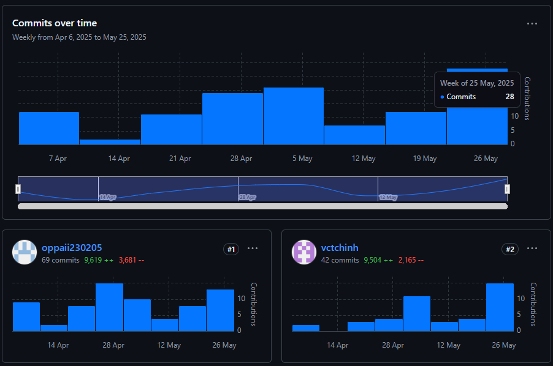
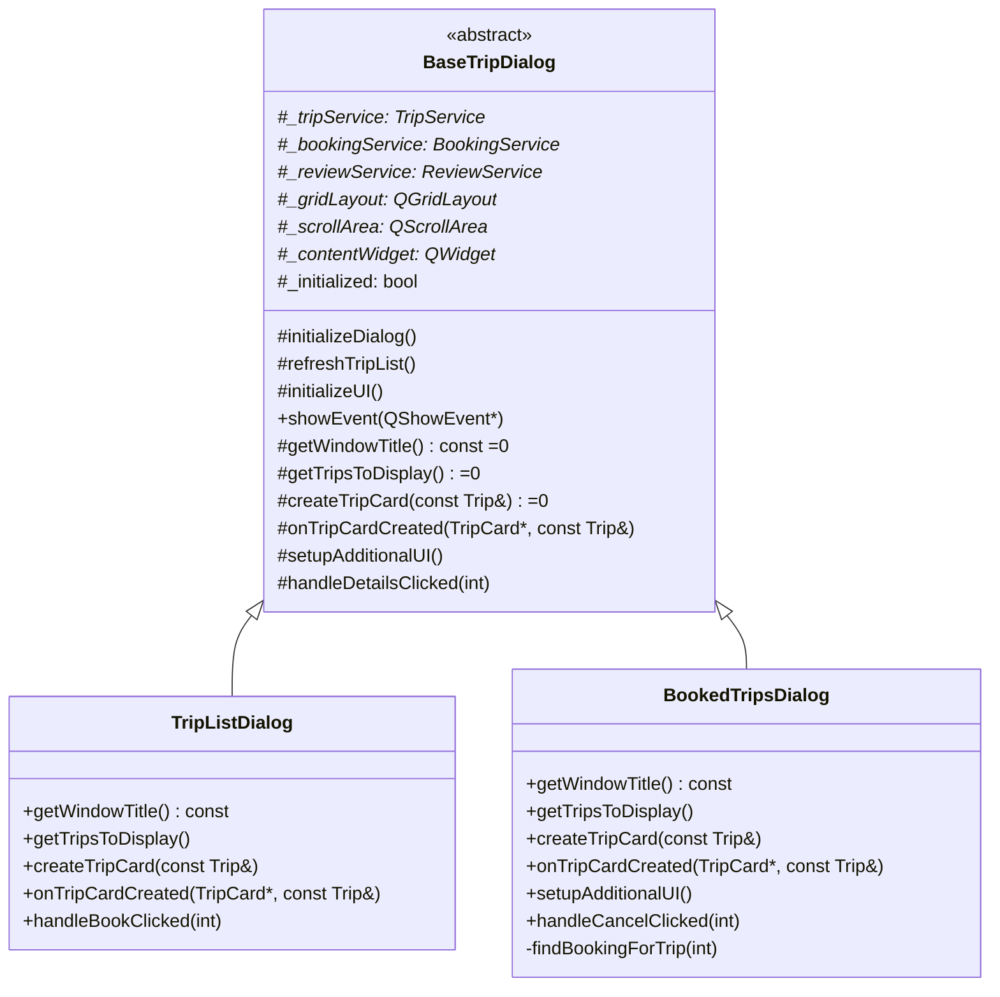
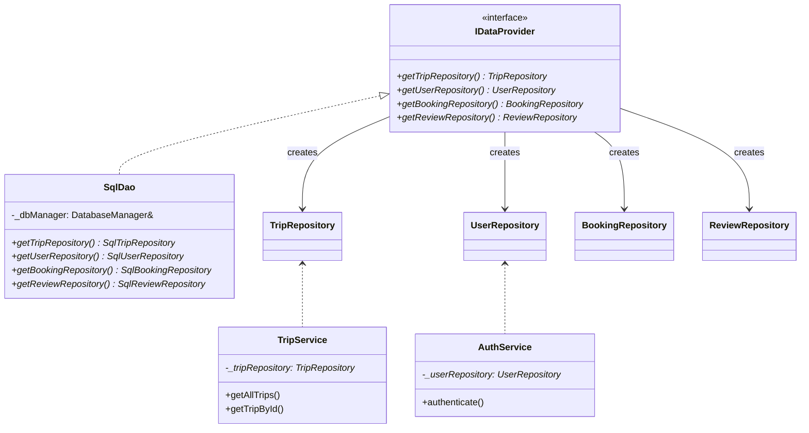
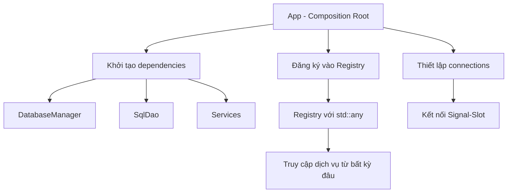
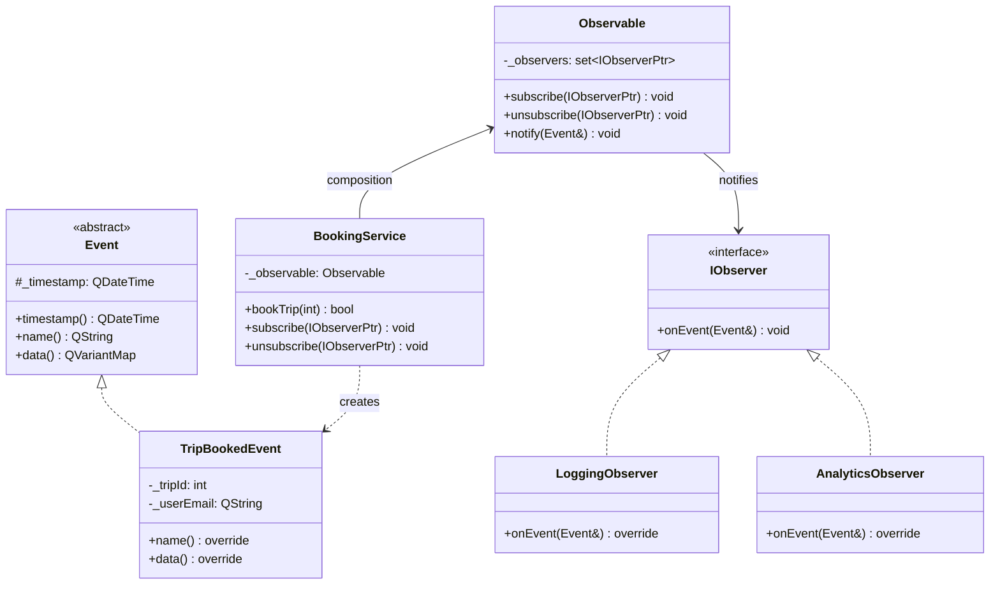
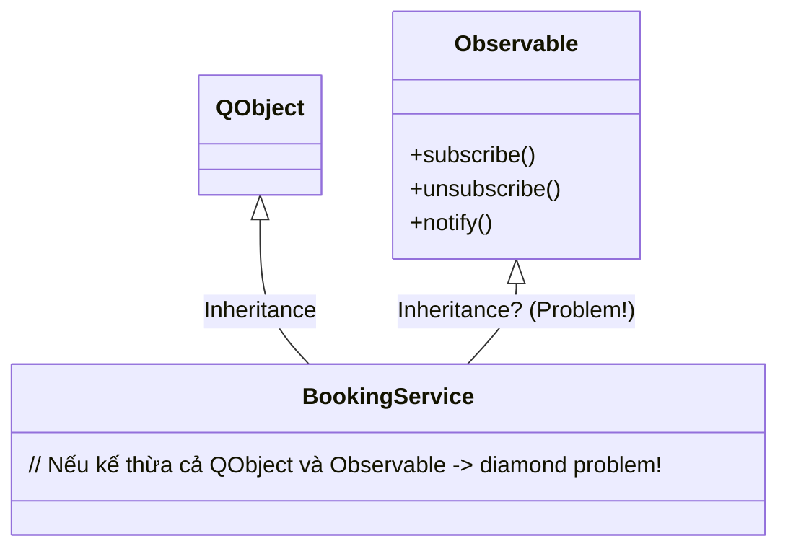
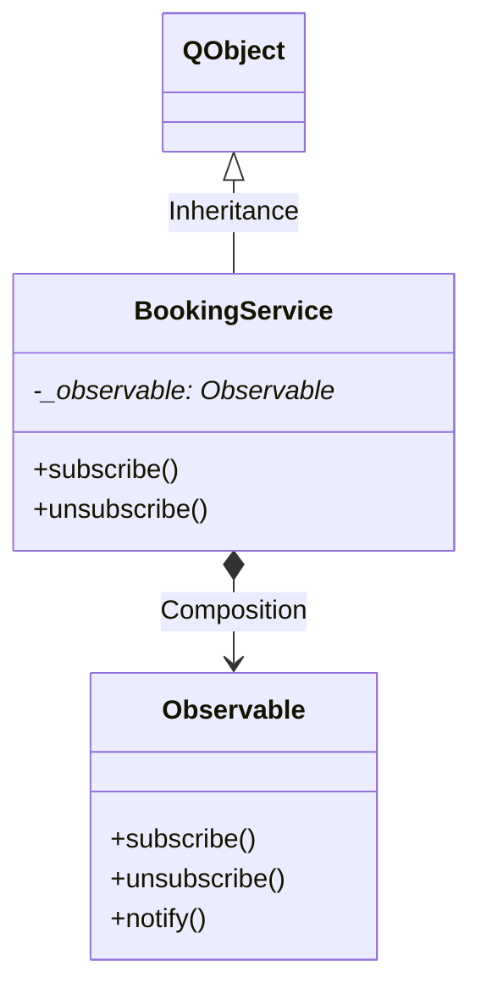

# Project Proposal

## Thành viên nhóm

1.  _Võ Cao Tâm Chính_  
    MSSV: **23120194**
2.  _Nguyễn Hưng Thịnh_  
    MSSV: **23120200**

## Phân chia công việc

| STT | Họ tên            | Vai trò     | Công việc                                                                                                                                                                                                                                                                                                     | Tỷ lệ phân chia công việc |
| --- | ----------------- | ----------- | ------------------------------------------------------------------------------------------------------------------------------------------------------------------------------------------------------------------------------------------------------------------------------------------------------------- | ------------------------- |
| 1   | Nguyễn Hưng Thịnh | Nhóm trưởng | Tạo Github Repositories cho dự án, xác định kiến trúc phần mềm, tổng hợp các nguyên tắc OOP, Design Pattern cần tuân thủ, thiết kế và xây dựng các lớp, chức năng thêm chuyến đi và đặt chuyến đi. Thiết kế UI cho các chức năng đã viết, video hướng dẫn sử dụng.                                            | 50%                       |
| 2   | Võ Cao Tâm Chính  | Thành viên  | Tạo máy chủ Azure Clouds để lưu trữ Database, tạo cơ sở dữ liệu, tổng hợp các Coding Convention cần tuân thủ, thực hiện Unit test các thành phần đã hoàn thiện. Thiết kế và xây dựng các lớp, chức năng người dùng, đăng nhập tài khoản, đăng ký tài khoản, đăng xuất. Thiết kế UI cho các chức năng đã viết. | 50%                       |

## Tỉ lệ điểm

**Chia đều** cho tất cả thành viên.

## Báo cáo tiến độ dự án

**Tên dự án**: Travel Agency Management System  
**Ngày báo cáo**: 30/05/2025  
**Giai đoạn**: Phát triển chức năng sản phẩm  
**Người phụ trách**: Nguyễn Hưng Thịnh - Võ Cao Tâm Chính

**Tóm tắt tiến độ**

- Tiến độ tổng thể: 100% hoàn thành
- Tiến độ so với kế hoạch: Đúng tiến độ

**Công việc đã hoàn thành**

| STT | Hạng mục                                    | Trạng thái | Ghi chú                                                                                   |
| --- | ------------------------------------------- | ---------- | ----------------------------------------------------------------------------------------- |
| 1   | Thống nhất tài liệu mô tả coding convention | Hoàn thành |                                                                                           |
| 2   | Xây dựng CSDL trên SQL Server               | Hoàn thành |                                                                                           |
| 3   | Thiết kế lại mã nguồn hướng đối tượng       | Hoàn thành |                                                                                           |
| 4   | Thiết kế giao diện (UI)                     | Hoàn thành | Giao diện thân thiện, trực quan với người dùng                                            |
| 5   | Viết mã nguồn cho toàn bộ dự án             | Hoàn thành | Hoàn thành tất cả các thiết kế đã đề ra. Đã có đầy đủ các chức năng cải tiến              |
| 6   | Thiết kế giao diện cho sản phẩm             | Hoàn thành | Hoàn thành tất cả các UI/UX ở tất cả các chức năng, thân thiện & trực quan cho người dùng |

**Thống kê số lần commit**



**Kết luận**

Nhóm đã hoàn thành tương đối tốt nội dung đề án. Các chức năng & cải tiến được nhóm thực hiện chỉnh chu & kĩ càng, đáp ứng tốt các yêu cầu đồ án đặt ra.

## Minh chứng họp nhóm

### Minh chứng họp nhóm lần 1

**Thông tin chung**

- Thời gian bắt đầu: 21h00, ngày 08/04/2025
- Thời gian kết thúc: 21h30, ngày 08/04/2025
- Địa điểm: Google Meet (<https://meet.google.com/jjp-fsff-oae>)
- Thành viên có mặt:
  \+ Nguyễn Hưng Thịnh (Trưởng nhóm)
  \+ Võ Cao Tâm Chính
- Vắng mặt: Không

**Nội dung**

- Đề xuất ban đầu:
  \+ Đề tài 1: Travel Agency Management System
  \+ Đề tài 2: Game Cờ Vua
- Thảo luận
  Đề tài 1:
  -- Dễ dàng phân tích thành các đối tượng (Class) như User, Trip, Booking với quan hệ rõ ràng (kế thừa, đa hình).
  --- Dễ dàng thêm tính năng mới.
  --- Có tính ứng dụng thực tế.
  --- Xử lý được các nghiệp vụ phức tạp (quản lý đặt tour, hủy tour).
  Đề tài 2:
  --- Các đối tượng dễ định nghĩa áp dụng được tính đa hình.
  --- Chủ yếu xử lý luật game, it nghiệp vụ phức tạp.
  --- Khó ứng dụng chủ yếu phục vụ học thuật
  --- Ít cơ hội tích hợp API, cơ sở dữ liệu
- Biểu quyết:
  Cả nhóm nhất trí chọn đề tài 1 (Travel Agency Management System) với 2/2 số phiếu

Phân công công việc

| STT | Họ tên            | Vai trò     | Công việc                                                                                                                | Tỷ lệ phân chia công việc |
| --- | ----------------- | ----------- | ------------------------------------------------------------------------------------------------------------------------ | ------------------------- |
| 1   | Nguyễn Hưng Thịnh | Nhóm trưởng | Tạo Github Repositories cho dự án, xác định kiến trúc phần mềm, tổng hợp các nguyên tắc OOP, Design Pattern cần tuân thủ | 50%                       |
| 2   | Võ Cao Tâm Chính  | Thành viên  | Tạo máy chủ Azure Clouds để lưu trữ Database, tạo cơ sở dữ liệu, tổng hợp các Coding Convention cần tuân thủ             | 50%                       |

**Cam kết chung**

- Tuân thủ deadline và các quy tắc lập trình.
- Họp đột xuất nếu có vấn đề phát sinh

**Kết luận**

- Đề tài chính thức: Travel Agency Management System
- Công cụ sử dụng:
  \+Quản lý dự án: Github
  \+ Frontend: Qt
  \+ Backend: C++
  \+ Database: SQL Server + Azure Clouds

### Minh chứng họp nhóm lần 2

**Thông tin chung**

- Thời gian bắt đầu: 21h00, ngày 24/04/2025
- Thời gian kết thúc: 21h30, ngày 24/04/2025
- Địa điểm: Google Meet (<https://meet.google.com/jjp-fsff-oae>)
- Thành viên có mặt:
  \+ Nguyễn Hưng Thịnh (Trưởng nhóm)
  \+ Võ Cao Tâm Chính

- Vắng mặt: Không

**Nội dung họp**

Đánh giá mực độ hoàn thành công việc:

| Họ Tên            | Mức độ hoàn thành | Ghi chú                                                 |
| ----------------- | ----------------- | ------------------------------------------------------- |
| Nguyễn Hưng Thịnh | 85%               | Nghiên cứu bổ sung thêm Design Pattern                  |
| Võ Cao Tâm Chính  | 85%               | Số lượng Coding Convention còn hạn chế cần bổ sung thêm |

Đánh giá tiến độ đồ án
\+ Tiến độ tổng thể: 19.5% hoàn thành
\+ Tiến độ so với kế hoạch: Đúng tiến độ

Phân công công việc mới
| STT | Họ tên | Vai trò | Công việc | Tỷ lệ phân chia công việc |
| --- | --- | --- | --- | --- |
| 1 | Nguyễn Hưng Thịnh | Nhóm trưởng | Thiết kế và xây dựng các lớp, chức năng thêm chuyến đi và đặt chuyến đi. Thiết kế UI cho các chức năng đã viết, tạo video demo và tài liệu hướng dẫn. | 50% |
| 2 | Võ Cao Tâm Chính | Thành viên | Thiết kế và xây dựng các lớp, chức năng người dùng, đăng nhập tài khoản, đăng ký tài khoản, đăng xuất. Thiết kế UI cho các chức năng đã viết. Thực hiện Unit test các thành phần đã hoàn thiện. | 50% |

**Cam kết chung**

- Tuân thủ deadline và các quy tắc lập trình.
- Họp đột xuất nếu có vấn đề phát sinh

**Kết luận**

- Các thành viên đều hoàn thành công việc ở mức tốt
- Đồ án đúng tiến độ

### Minh chứng họp nhóm lần 3

**Thông tin chung**

- Thời gian bắt đầu: 22h00, ngày 05/05/2025
- Thời gian kết thúc: 22h30, ngày 25/05/2025
- Địa điểm: Google Meet (<https://meet.google.com/jjp-fsff-oae>)
- Thành viên có mặt:
  \+ Nguyễn Hưng Thịnh (Trưởng nhóm)
  \+ Võ Cao Tâm Chính
- Vắng mặt: Không

**Nội dung họp**

Đánh giá mực độ hoàn thành công việc được giao:

| Họ Tên            | Mức độ hoàn thành | Ghi chú |
| ----------------- | ----------------- | ------- |
| Nguyễn Hưng Thịnh | 100%              |         |
| Võ Cao Tâm Chính  | 100%              |         |

Đánh giá tiến độ đồ án
\+ Tiến độ tổng thể: 52% hoàn thành
\+ Tiến độ so với kế hoạch: Đúng tiến độ

Phân công công việc mới

| STT | Họ tên            | Vai trò     | Công việc                                                            | Tỷ lệ phân chia công việc |
| --- | ----------------- | ----------- | -------------------------------------------------------------------- | ------------------------- |
| 1   | Nguyễn Hưng Thịnh | Nhóm trưởng | Tổng hợp các nội dung báo cáo, release sản phẩm, nộp bài             | 50%                       |
| 2   | Võ Cao Tâm Chính  | Thành viên  | Tổng hợp các nội dung cần báo cáo, tổng hợp minh chứng các cuộc họp. | 50%                       |

**Cam kết chung**

- Tuân thủ deadline và các quy tắc lập trình.
- Họp đột xuất nếu có vấn đề phát sinh

**Kết luận**

- Các thành viên đều hoàn thành công việc ở mức tốt
- Đồ án đúng tiến độ

## Thông tin chi tiết đồ án

### Yêu cầu

1. Yêu cầu cụ thể: Sử dụng mã nguồn được cung cấp sẵn viết lại theo hướng đối tượng (OOP), đông thời bổ sung thêm các cải tiến áp dụng các nguyên tắc (SOLID), các design pattern, nguyên lí dependency injction và áp dụng kiến trúc phần mềm tùy chọn.
2. Thời gian thực hiện: 8 tuần
3. Thực hiện đảm bảo mã nguồn bằng:

   a. Quản lí mã nguồn với git: sinh viên tự lựa chọn qui trình, khuyến khích sử dụng “feature branch workflow”

   b. Tài liệu mô tả coding convention: các tiêu chuẩn thống nhất về mã nguồn mà các thành viên phải tuân theo

   c. Kiểm thử bằng unit test. Cần tạo ra test plan, các test case và test report

4. Tạo ra các tài liệu mô tả kiến trúc phần mềm, mô tả các module:

   a. Vẽ class diagram  
   b. Tạo tài liệu mô tả về các lớp, ý nghĩa các hàm

### Cách thức đánh giá

1. Teamwork: 15%. Phân công và theo dõi tiến độ công việc, biên bản họp nhóm.
2. UI/UX: 20%. Chính là điểm chức năng cũng như giao diện của chương trình.
3. Kiến trúc phần mềm + design pattern: 20%. Mô tả bạn đã thiết kế chương trinh theo kiến trúc phần mềm ra sao, tuân thủ theo các nguyên tắc và nguyên lí OOP như thế nào, dùng các design pattern gì.
4. Đảm bảo chất lượng: 20%. test / coding convention.
5. Tài liệu mô tả kiến trúc phần mềm và các module: 10%
6. Các chủ đề nâng cao: 15%. Là các chủ đề có độ khó, độ phức tạp ở mức cao nhóm tự tìm hiểu mà giáo viên không đề cập trên lớp.

<!-- ## Cách thức quản lý nhóm -->

## Đề tài được chọn: [**Travel Agency Management System**](https://www.codewithc.com/travel-agency-management-system-in-c-with-mysql/)

### Tình trạng hiện tại

- Tổ chức mã nguồn còn rời rạc, thiếu tính liên kết.
- Giao diện console app, chưa thực sự thân thiện & gần gũi với người dùng.
- Thiết kế cơ sở dữ liệu còn đơn giản, chưa thực sự chứa đựng đầy đủ thông tin cần thiết.
- Logic chương trình còn sơ khai, chưa hình thành được các luồng sự kiện chính sẽ xuất hiện.

### Kiến trúc phần mềm áp dụng

- Kiến trúc phần mềm được sử dụng trong đồ án: **Mô hình 3-layer**
- Giới thiệu mô hình: gồm có 3 phần chính (hay còn gọi là **lớp**)

  - **Presentation Layer (GUI):** Lớp này có nhiệm vụ chính giao tiếp với người dùng. Nó gồm các thành phần giao diện và thực hiện các công việc như nhập liệu, hiển thị dữ liêu, kiểm tra tính đúng đắn dữ liệu trước khi gọi lớp Business Logic Layer (BLL).

  - **Business Logic Layer (BLL):** Layer này phân ra 2 thành nhiệm vụ:

    - Đây là nơi đáp ứng các yêu cầu thao tác dữ liệu của GUI layer, xử lý chính nguồn dữ liệu từ Presentation Layer trước khi truyền xuống Data Access Layer và lưu xuống hệ quản trị CSDL.
    - Đây còn là nơi kiểm tra các ràng buộc, tính toàn vẹn và hợp lệ dữ liệu, thực hiện tính toán và xử lý các yêu cầu nghiệp vụ, trước khi trả kết quả về Presentation Layer.

  - **Data Access Layer (DAL):** Lớp này có chức năng giao tiếp với hệ quản trị CSDL như thực hiện các công việc liên quan đến lưu trữ và truy vấn dữ liệu ( tìm kiếm, thêm, xóa, sửa,…).

#### Chi tiết mô tả kiến trúc phần mềm

- Presentation Layer (GUI)

  Trách nhiệm:

  - Giao tiếp trực tiếp với người dùng thông qua giao diện đồ họa (Qt Widgets).

  - Hiển thị dữ liệu từ Business Logic Layer (BLL) và chuyển tương tác người dùng (nhấn nút, nhập liệu) xuống BLL.

  Thành phần chính:

  - `LoginWindow`: Xử lý đăng nhập/đăng ký, kết nối với AuthService.

  - `MainWindow`: Cửa sổ chính hiển thị chức năng theo vai trò người dùng (admin/customer).

  - Các Dialog (`AddTripDialog`, `TripListDialog`,...): Tạo giao diện cụ thể cho từng nghiệp vụ.

- Business Logic Layer (BLL)

  Trách nhiệm:

  - Xử lý nghiệp vụ: kiểm tra quyền, validate dữ liệu, tính toán.

  - Đóng vai trò trung gian giữa GUI và Data Access Layer (DAL).

  Thành phần chính:

  - `AuthService`:

    - Quản lý đăng nhập, phân quyền (admin/customer)..

  - `TripService`, `UserService`,...:

    - Kiểm tra quyền trước khi thực hiện các chức năng.

    - Chuyển dữ liệu hợp lệ xuống DAL.

- Data Access Layer (DAL)

  Trách nhiệm:

  - Giao tiếp với database: thực thi truy vấn SQL, ánh xạ dữ liệu thành đối tượng.

  - Đảm bảo tính toàn vẹn dữ liệu.

  Thành phần chính:

  - Repository Pattern:

    - `SqlUserRepository`: Quản lý truy vấn liên quan đến bảng User.

    - `SqlTripRepository`: Xử lý các thao tác với bảng Trip.

  - `DatabaseManager`:

    - Quản lý kết nối database dùng Singleton Pattern.

    - Hỗ trợ transaction và bắt lỗi SQL.

- Ví dụ tương tác giữa các lớp:

  - GUI gọi phương thức từ BLL (ví dụ: tripService->addTrip(trip)).
  - BLL kiểm tra nghiệp vụ, gọi DAL để lưu dữ liệu.
  - DAL thực thi SQL và trả kết quả ngược lên BLL → GUI.

  ```mermaid
   flowchart TD
      A[Presentation Layer] -->|Request| B[Business Logic Layer]
      B -->|Validate| C[Data Access Layer]
      C -->|SQL Query| D[(Database)]
      D -->|Result| C --> B --> A
  ```

### Các tính năng chính đã có

1. Tạo mới chuyến đi cho người dùng

2. Hiển thị danh sách người dùng hiện tại

3. Tìm kiếm người dùng cụ thể

4. Cập nhật lại thông tin người dùng

5. Xóa người dùng

6. Tạo chuyến đi mới

7. Cập nhật lại thông tin chuyến đi

8. Xóa chuyến đi

### Mở rộng

1. Tạo giao diện cho phần mềm

   - Thay vì sử dụng đồ họa console như mã nguồn đã có sẵn, chương trình sẽ được xây dựng thêm **GUI (Graphic User Interface)**, giúp các thao tác trên phần mềm trở nên dễ dàng và trực quan hơn.
   - Framework được sử dụng sẽ là: **Qt** _(có thể thay đổi nếu tìm thấy framework phù hợp hơn)_

2. Chức năng đăng nhập / tạo tài khoản mới

   - Thêm chức năng đăng nhập & tạo tài khoản. Người dùng cần phải có tài khoản để sử dụng phần mềm này.
   - Thông tin tài khoản (tên đăng nhập, mật khẩu, họ tên,...) sẽ đều được lưu trên CSDL, giúp xác thực được người dùng cho nhiều phiên đăng nhập.
   - Bên cạnh đó, thông tin tài khoản còn lưu thêm **vai trò (role)** cụ thể của người dùng, giúp phân quyền các nhóm chức năng cho từng loại user khác nhau.

3. Phân quyền người dùng

   - Đối với mỗi loại người dùng cụ thể (VD: quản trị viên, người dùng thường,...) sẽ có các quyền khác nhau, thay vì có thể thực hiện được mọi chức năng như trong mã nguồn có sẵn. VD: người dùng thường chỉ có thể tạo lập, cập nhật thông tin của họ, chứ không thể thay đổi thông tin của người dùng khác.

4. Thêm module **Review** để lưu trữ đánh giá của người dùng cho chuyến đi tương ứng

   - Mỗi user sẽ có thể đưa ra đánh giá cho các chuyến đi mình đã trải nghiệm.
   - Thông tin 1 bản ghi đánh giá bao gồm: đoạn văn đánh giá (text), điểm rating (1-5), thời gian tạo, chuyến đi được đánh giá, người đánh giá.
   - Chức năng hiển thị các bài đánh giá cho từng chuyến đi cụ thể, hiển thị các bài đánh giá của người dùng hiện đang đăng nhập.

5. Xuất hóa đơn khi khách hàng xác nhận
   - Mỗi khi khách hàng xác nhận chuyến đi hệ thống sẽ tự động tính toán chi phí và xuất ra hóa đơn ra file .txt.
   - Hóa đơn bao gồm: Tên khách hàng, số điện thoại, ngày lập, thông tin chuyến đi, tổng thành tiền.
6. Hiển thị thời tiết tại điểm đến
   - Hiển thị thời tiết 5 ngày tiếp theo tại điểm đến trong chuyến đi đang được khách hàng lựa chọn.
   - Thông tin hiển thị bao gồm: Tên điểm đến, ngày dự đoán, nhiệt độ dự đoán, trạng thái thời tiết.
7. Chuyển đổi ngôn ngữ hiển thị
   - Trên giao diện phần mềm cung cấp tính năng chuyển đổi giữa hai ngôn ngữ Việt - Anh.

### Các nguyên tắc và nguyên lí OOP đã tuân thủ

#### Nguyên tắc SOLID

Đồ án tuân thủ nghiêm ngặt 5 nguyên tắc SOLID để đảm bảo tính mở rộng và dễ bảo trì:

**1. Single Responsibility Principle (SRP)**

**Định nghĩa**: Mỗi lớp chỉ có một trách nhiệm duy nhất, dễ dàng quản lí & kiểm soát chương trình.

**Ví dụ áp dụng trong đồ án:**

- Lớp `SqlTripRepository`, `SqlUserRepository`,...

  - Trách nhiệm duy nhất: Thực hiện các thao tác CRUD với bảng `Trip`, `User` trong database.
  - Code minh họa:

  ```cpp
  class SqlTripRepository {
  public:
   bool addTrip(const Trip& trip); // Chỉ thực hiện các thao tác CRUD vào DB
   QList<Trip> getAllTrips(); // Không chứa logic nghiệp vụ
  };

  ```

- Lớp `TripService`, `UserService`, `AuthService`,...

  - Trách nhiệm duy nhất: Chứa các thông tin nghiệp vụ (tính toán, kiểm tra quyền, validation,...), giải quyết bài toán thực tế của phần mềm. Chứa các chức năng, yêu cầu cụ thể phục vụ cho người sử dụng phần mềm.

  - Code minh họa:

  ```cpp
  class TripService {
  public:
   // Basic CRUD operations, lấy dữ liệu thông qua các lớp Repository trước đó, không liên quan đến database thực sự.
   QList<Trip> getAllTrips();

   // Business logic methods
   QList<Trip> findTripsByDifficulty(const QString& difficulty);

   // Validation
   bool validateTrip(const Trip& trip) const;
  }
  ```

- Lớp `AddTripDialog`, `TripListDialog`, `ShowUserInformationDialog`,...

  - Trách nhiệm duy nhất: Định nghĩa giao diện để người dùng có thể tương tác với phần mềm. Không liên quan đến logic nghiệp vụ và database của phần mềm.

  - Code minh họa:

  ```cpp
   namespace Ui {
   class TripListDialog;
   }

   class TripListDialog : public QDialog
   {
      Q_OBJECT

   private:
      void setupModel();
      void refreshTripList();
      void setupActions(); // Thêm hàm thiết lập actions

   private:
      Ui::TripListDialog *ui; // Đặc trưng của Qt khi làm C++ GUI App
      QSharedPointer<TripService> _tripService; // Lấy/Đẩy dữ liệu thông qua lớp Service
      QStandardItemModel* _model; // Model quản lý dữ liệu
   };
  ```

- Lớp `Trip`, `User`, ...

  - Trách nhiệm duy nhất: Đây là các model của phần mềm (hay _Data Transfer Object - DTO_), chỉ dùng để chứa dữ liệu và đi qua các tầng trong kiến trúc phần mềm.

  - Code minh họa:

  ```cpp
   class User {
      private:
         QString _email;
         QString _password;
         QString _name;
         QString _role;
      public:
         User();
         User(const QString& email, const QString& password, const QString& name, const QString& role);

         QString email() const;
         // other getters...

         void setEmail(const QString& email);
         // other setters...

         bool isValid() const;
   };
  ```

**Lợi ích:** Trong quá trình phát triển phần mềm, nếu cần thay đổi database schema (thêm ảnh, thông tin, thêm logic nghiệp vụ, chức năng...) thì chỉ cần sửa ở một số lớp cụ thể mà không làm ảnh hưởng tới toàn bộ chương trình.

**2. Open / Closed Principle (OCP)**

**Định nghĩa**: Có thể mở rộng các lớp nhưng không sửa đổi code có sẵn.

**Ví dụ áp dụng trong đồ án:**

- Thêm service mới (ví dụ: `BookingService`, `PaymentService`) bằng cách inject vào GUI thông qua constructor, không cần sửa `MainWindow`.

  - Code minh họa:

  ```cpp
  MainWindow::MainWindow(QSharedPointer<AuthService> authService,
                     QSharedPointer<TripService> tripService,
                     QSharedPointer<BookingService> bookingService)
  ```

- Mở rộng/Thay đổi kiểu database

  - Trách nhiệm duy nhất: Sử dụng interface `TripRepository`, `UserRepository` để sau này có thể thêm kiểu cơ sở dữ liệu phi quan hệ (Ví dụ: `MongoTripRepository`) vào chương trình, không ảnh hưởng đến các lớp khác.

  - Code minh họa:

  ```cpp
   class TripService {
   private:
      QSharedPointer<TripRepository> _repository; // sử dụng interface thay vì concrete class
      bool validateTrip(const Trip& trip) const;

   public:
      explicit TripService(QSharedPointer<TripRepository> repository, QObject* parent = nullptr);
   };
  ```

**Lợi ích:** Chương trình sẽ **cho phép** mở rộng thêm các tính năng một cách dễ dàng, linh hoạt để đáp ứng nhu cầu của khách hàng, trong khi **không cho phép** thay đổi code có sẵn - điều sẽ rất dễ gây ra các bug không mong muốn.

**3. Liskov Substitution Principle (LSP)**

**Định nghĩa**: Lớp con phải thay thế được lớp cha mà không phá vỡ chương trình.

**Ví dụ áp dụng trong đồ án:**

- Các repository (`SqlUserRepository`, `SqlTripRepository`) đều kế thừa từ interface (`UserRepository`, `TripRepository`), đảm bảo có thể hoán đổi khi cần chuyển từ SQL sang NoSQL. _(đã trình bày ở nguyên tắc 2 - Open/Closed Principle)_

- Sử dụng cho Testing: Dù là `SqlUserRepository` hay `MockUserRepository` (dùng cho test), `AuthService` vẫn hoạt động đúng.

**Lợi ích:** Liskov Substitution Principle (LSP) giúp đảm bảo rằng lớp con có thể thay thế lớp cha mà không làm thay đổi hành vi của hệ thống, từ đó giúp hệ thống ổn định, dễ mở rộng và tránh lỗi do kế thừa sai cách.

**4. Interface Segregation Principle (ISP)**

**Định nghĩa**: Client không nên phụ thuộc vào interface mà nó không dùng.

**Ví dụ áp dụng trong đồ án:**

- Interface **nhỏ, chuyên biệt**: Tách thành 2 interface `TripRepository` và `UserRepository` thay vì một interface lớn `Repository`.

- Vì `AuthService` chỉ cần các thông tin và các hàm liên quan đến `User` như `addUser()`, `getUserByEmail()`,... nên chỉ cần tiêm dependency `UserRepository` vào `AuthService`, giảm sự phụ thuộc thừa.

  - Code minh họa:

  ```cpp
   // ✅ Đúng ISP
   class UserRepository {
   public:
      virtual bool addUser(const User& user) = 0;
      virtual QSharedPointer<User> getUserByEmail(const QString& email) = 0;
   };

   class TripRepository {
   public:
      virtual bool addTrip(const Trip& trip) = 0;
      virtual QList<Trip> getAllTrips() = 0;
   };

   //.......
   // Các service
   class AuthService {
   private:
      QSharedPointer<UserRepository> _userRepository; // chỉ phụ thuộc vào UserRepository
      QSharedPointer<User> _currentUser; // lưu lại user hiện tại
   };

  ```

**Lợi ích:** Giúp giảm sự phụ thuộc thừa cho chương trình (`AuthService` chỉ phụ thuộc vào `UserRepository`, không biết gì về `TripRepository`), cũng như dễ bảo trì cho chương trình (Thêm/xóa phương thức trong `TripRepository` không làm hỏng `AuthService`).

**5. Dependency Inversion Principle (DIP)**

**Định nghĩa**: Thay vì để module cấp cao không phụ thuộc vào module cấp thấp, cả hai nên phụ thuộc vào abstraction.

**Ví dụ áp dụng trong đồ án:**

- Định nghĩa abstraction (interface) cho repository.

  - Code minh họa:

  ```cpp
   // ✅ Đúng DIP
   class UserRepository {
   public:
      virtual QSharedPointer<User> getUserByEmail(const QString& email) = 0;
      virtual bool addUser(const User& user) = 0;
   };
  ```

- Module cấp cao (AuthService) phụ thuộc vào interface.

  - Code minh họa:

  ```cpp
   class AuthService {
   private:
      QSharedPointer<UserRepository> _userRepo; // Phụ thuộc vào abstraction
   public:
      AuthService(QSharedPointer<UserRepository> repo) : _userRepo(repo) {}
   };
  ```

- Module cấp thấp (`SqlUserRepository`) _implement_ interface.

  - Code minh họa:

  ```cpp
   class SqlUserRepository : public UserRepository {
   public:
      QSharedPointer<User> getUserByEmail(const QString& email) override {
         // Logic truy vấn từ SQL database
      }
   };
  ```

- Sơ đồ mô tả luồng chương trình

  ```mermaid
  sequenceDiagram
   participant GUI as MainWindow
   participant BLL as AuthService
   participant DAL as SqlUserRepository
   GUI->>BLL: login("user@example.com", "pass123")
   BLL->>DAL: getUserByEmail("user@example.com")
   DAL-->>BLL: User object
   BLL-->>GUI: Kết quả đăng nhập
  ```

- Cài đặt code

  - `MainWindow` gọi `AuthService` (cấp cao).
  - `AuthService` gọi `UserRepository` (abstraction), không biết chi tiết là SQL hay NoSQL.

- Ví dụ mở rộng (sử dụng NoSQL Database)

  ```cpp
  class MongoUserRepository : public UserRepository {
  public:
     QSharedPointer<User> getUserByEmail(const QString& email) override {
        // Logic truy vấn từ MongoDB
     }
  };

  // Trong main.cpp
  auto userRepo = QSharedPointer<MongoUserRepository>::create();
  auto authService = QSharedPointer<AuthService>::create(userRepo);
  ```

**Lợi ích:** Giảm coupling giữa các lớp. Dễ dàng thay thế, mở rộng module mà không cần sửa code hiện có.

#### Nguyên lí Dependency Injection (DI)

**Định nghĩa**: Cung cấp các dependency (phụ thuộc) từ bên ngoài vào một lớp thay vì để lớp tự khởi tạo chúng.

**Ví dụ áp dụng trong đồ án:**

- Khởi Tạo Dependency: Trong `main.cpp`, tất cả dependency được khởi tạo và inject vào các lớp cần thiết.

  ```cpp
  int main() {
   // 1. Khởi tạo repository
   auto userRepo = QSharedPointer<SqlUserRepository>::create(DatabaseManager::getInstance());

   // 2. Inject repository vào AuthService
   auto authService = QSharedPointer<AuthService>::create(userRepo);

   // 3. Inject AuthService vào LoginWindow
   LoginWindow loginWindow(authService);
  }
  ```

- DI Trong Service Layer: `TripService` nhận `TripRepository` qua constructor.

  ```cpp
  class TripService {
  private:
     QSharedPointer<TripRepository> _tripRepo;
  public:
     TripService(QSharedPointer<TripRepository> repo) : _tripRepo(repo) {}

     bool addTrip(const Trip& trip) {
        return _tripRepo->addTrip(trip); // Gọi abstraction, không phụ thuộc implementation
     }
  };
  ```

- DI Trong UI Layer: `MainWindow` nhận các service qua constructor.

  ```cpp
  MainWindow::MainWindow(QSharedPointer<AuthService> authService,
                       QSharedPointer<TripService> tripService)
     : _authService(authService), _tripService(tripService)
  {
     // Kết nối signal-slot
     connect(_tripService.data(), &TripService::tripAdded,
           this, &MainWindow::onTripAdded);
  }
  ```

**Lợi ích**: DI là xương sống của kiến trúc phần mềm hiện đại, giúp đồ án trở nên linh hoạt, dễ bảo trì. Đây còn là nền tảng để áp dụng nguyên tắc SOLID. Kết hợp cùng Interface để tuân thủ _Dependency Inversion Principle (DIP)_ và _Smart Pointer_ để quản lí vùng nhớ an toàn.

### Các Design Pattern đã áp dụng

**1. Singleton Pattern**

**Mục đích:** Đảm bảo chỉ có một instance duy nhất của một lớp trong toàn bộ ứng dụng.

**Ví dụ áp dụng trong đồ án:**

- Lớp `DatabaseManager`: Quản lý kết nối database toàn cục.

  - Code minh họa:

    ```cpp
    class DatabaseManager {
    private:
       static DatabaseManager* _instance; // Biến static
       DatabaseManager() {} // Constructor private

    public:
       static DatabaseManager& getInstance() {
          if (!_instance) _instance = new DatabaseManager();
          return *_instance;
       }
    };
    ```

  - Ví dụ sử dụng:

    ```cpp
    // Truy cập database từ bất kỳ đâu
    DatabaseManager& db = DatabaseManager::getInstance();
    QSqlDatabase connection = db.getConnection();
    ```

**Lợi ích:** Tiết kiệm tài nguyên kết nối đến database. Đảm bảo tính nhất quán của dữ liệu, tránh trường hợp xung đột khi có nhiều hơn 1 instance cùng ghi vào một database.

**2. Repository Pattern**

**Mục đích:** Tách biệt logic truy cập dữ liệu khỏi logic nghiệp vụ.

**Ví dụ áp dụng trong đồ án:**

- Các lớp `SqlUserRepository`, `SqlTripRepository`.

  - Code minh họa:

    ```cpp
    class UserRepository {
    public:
       virtual bool addUser(const User& user) = 0;
       virtual QSharedPointer<User> getUserByEmail(const QString& email) = 0;
    };

    class SqlUserRepository : public UserRepository {
    public:
       bool addUser(const User& user) override {
          // Logic thêm user vào SQL database
       }
    };
    ```

  - Ví dụ sử dụng:

    ```cpp
    auto userRepo = QSharedPointer<SqlUserRepository>::create(DatabaseManager::getInstance());
    AuthService authService(userRepo);
    ```

**Lợi ích:** Dễ dàng thay đổi database (SQL → NoSQL, hoặc sử dụng file text,...) mà không ảnh hưởng đến service layer. Chuyên biệt chức năng của từng tầng, giúp kiểm soát & phát triển phần mềm dễ dàng hơn.

**3. Observer Pattern**

**Mục đích:** Giúp các đối tượng phản ứng với sự kiện từ đối tượng khác.

**Ví dụ áp dụng trong đồ án:**

- **Signal-Slot trong Qt**: Kết nối giữa GUI và service layer.

  - Code minh họa:

    ```cpp
    // TripService phát signal khi có lỗi
    class TripService : public QObject {
       Q_OBJECT
    signals:
       void errorOccurred(const QString& message);
    };

    // MainWindow lắng nghe signal
    MainWindow::MainWindow(QSharedPointer<TripService> tripService) {
       connect(tripService.data(), &TripService::errorOccurred,
             this, &MainWindow::showError);
    }
    ```

- **Cải tiến**: Tạo ra các lớp _Observer_ và _Observable_ để thoải mái cài đặt quan hệ lắng nghe-phản ứng giữa các đối tượng với nhau.

  - Code minh họa:

    - Lớp `IObserver`

    ```cpp
    class IObserver {
    public:
        virtual ~IObserver() = default;
        virtual void onEvent(const Event& event) = 0; // phản ứng khi nhận được sự kiện
    };
    ```

    - Lớp `Observable`

    ```cpp
    class Observable : public QObject {
    Q_OBJECT
    public:
        void subscribe(IObserverPtr observer) {
          _observers.insert(observer);
        }

        void Observable::unsubscribe(IObserverPtr observer) {
          _observers.erase(observer);
        }

        void Observable::notify(const Event& event) {
          for (const auto& observer : _observers) {
            observer->onEvent(event);
          }
        }

    protected:
        std::set<IObserverPtr> _observers;
    };
    ```

    - Lớp `Event`

    ```cpp
    class Event {
    public:
        Event() : _timestamp(QDateTime::currentDateTime()) {}
        virtual ~Event() = default;

        QDateTime timestamp() const { return _timestamp; }
        virtual QString name() const = 0;
        virtual QVariantMap data() const = 0;

    private:
        QDateTime _timestamp;
    };
    ```

    - Ví dụ áp dụng **Observer Pattern** với _BookingService_: log lại thông tin booking của người dùng mỗi khi booking thành công.

      - Lớp `LoggingObserver` (kế thừa lớp `IObserver`)

      ```cpp
      class LoggingObserver : public IObserver {
      public:
          void onEvent(const Event& event) override {
              qDebug() << "[" << event.timestamp().toString(Qt::ISODate) << "]"
                      << event.name() << "event occurred with data:" << event.data();
          }
      };
      ```

      - Lớp `TripBookedEvent`: Sự kiện một chuyến đi đã được đặt (kế thừa lớp `Event`)

      ```cpp
      class TripBookedEvent : public Event {
      public:
          TripBookedEvent(int tripId, const QString& userEmail)
              : _tripId(tripId), _userEmail(userEmail) {}

          QString name() const override { return "TripBooked"; }

          QVariantMap data() const override {
              return {
                  {"tripId", _tripId},
                  {"userEmail", _userEmail}
              };
          }

          int tripId() const { return _tripId; }
          QString userEmail() const { return _userEmail; }

      private:
          int _tripId;
          QString _userEmail;
      };
      ```

      - Lớp `BookingService`: đây chính là lớp đóng vai trò `Observable` (hay **publisher**) trong **Observer Pattern**, phát ra các sự kiện đến các _Observer_ đã đăng kí.

      ```cpp
      class BookingService : public QObject {
          Q_OBJECT
      public:
          explicit BookingService(QSharedPointer<BookingRepository> bookingRepo,
                                  QSharedPointer<TripService> tripService,
                                  QSharedPointer<AuthService> authService,
                                  QObject* parent = nullptr);

          // Other methods...

          // Provide access to observable functionality
          void subscribe(QSharedPointer<IObserver> observer);

          void unsubscribe(QSharedPointer<IObserver> observer);

      private:
          QSharedPointer<Observable> _observable; // "Composition over Inheritance"
          // Other properties...
      };
      ```

**Lợi ích:** Giảm coupling giữa GUI và business logic. Đồng thời, GUI sẽ được tự động cập nhật khi dữ liệu thay đổi.

**4. Kết hợp: Factory Pattern + Prototype Pattern + Registry Pattern** => **Prototype Registry Pattern**

**Mục đích:** **Factory Pattern + Prototype Pattern** cho phép lấy & sử dụng các đối tượng đã được tạo sẵn, thay vì phải tạo mới mỗi khi cần sử dụng, khiến mã nguồn trở nên độc lập với các lớp của các đối tượng này. Đồng thời, **Registry Pattern** là một mẫu thiết kế nhằm **tập trung hóa** việc quản lý và truy cập các đối tượng hoặc thể hiện được chia sẻ trong một ứng dụng phần mềm, từ đó thúc đẩy khả năng tái sử dụng và giảm thiểu sự phụ thuộc giữa các thành phần => tuân thủ nguyên tắc **Single Source Of Truth (SSOT)**.

**Ví dụ áp dụng trong đồ án:**

- Lớp `Registry`: Quản lí danh sách các đối tượng để chương trình có thể gọi đến mỗi khi cần (`IDataProvider` (nơi tập trung các repository), các `Service`,...)

  - Code minh họa:

  ```cpp
  class Registry {
  private:
      inline static QHash<QString, std::any> _instances;

  public:
      template<typename T>
      static void addSingleton(QSharedPointer<T> instance) {
          _instances.insert(QString::fromStdString(typeid(T).name()), instance);
      }

      template<typename T>
      static QSharedPointer<T> getSingleton() {
          auto it = _instances.constFind(QString::fromStdString(typeid(T).name()));
          if (it != _instances.constEnd()) {
              try {
                  return std::any_cast<QSharedPointer<T>>(it.value());
              } catch (const std::bad_any_cast& e) {
                  qWarning() << "Bad cast when getting singleton for type:" << typeid(T).name();
                  return nullptr;
              }
          }
          return nullptr;
      }
  ```

  - Ví dụ sử dụng:

    - Lớp `App`: Thiết lập sẵn các dependencies và connections, giảm sự phụ thuộc giữa các lớp đối tượng.

    ```cpp
    class App {
    private:
        QSharedPointer<LoginWindow> _loginWindow;
        QSharedPointer<MainWindow> _mainWindow;

        // Private methods cho việc thiết lập
        void loadGlobalStyles() {/*...*/}
        void setupObservers() {/*...*/}

        void setupDependencies() {
            // Khởi tạo DatabaseManager
            DatabaseManager& db = DatabaseManager::getInstance();

            // Đăng kí IDataProvider với Registry
            Registry::addSingleton<IDataProvider>(QSharedPointer<SqlDao>::create(db)); // Có thể thay thành `MockDao`

            // Khởi tạo DataProvider
            QSharedPointer<IDataProvider> dataProvider = Registry::getSingleton<IDataProvider>();

            // Đăng ký các service theo thứ tự dependency
            Registry::addSingleton<AuthService>(
                QSharedPointer<AuthService>::create(dataProvider->getUserRepository())
                );

            Registry::addSingleton<TripService>(
                QSharedPointer<TripService>::create(dataProvider->getTripRepository())
                );
            // Các dependency khác...
        }

        void setupConnections() {
            _loginWindow = QSharedPointer<LoginWindow>::create(
                Registry::getSingleton<AuthService>(),
                nullptr
                );

            // Kết nối signal loginSuccess để tạo MainWindow sau khi login
            QObject::connect(_loginWindow.data(), &LoginWindow::loginSuccess, [this]() {
                qDebug() << "Login successful, creating main window";
                _loginWindow->hide();

                // Tạo MainWindow sau khi login thành công
                _mainWindow = QSharedPointer<MainWindow>::create(
                    Registry::getSingleton<UserService>(),
                    Registry::getSingleton<AuthService>(),
                    Registry::getSingleton<TripService>(),
                    Registry::getSingleton<BookingService>(),
                    Registry::getSingleton<AzureStorageService>(),
                    Registry::getSingleton<ReviewService>()
                    );

                // Kết nối logout từ MainWindow sau khi MainWindow được tạo
                QObject::connect(_mainWindow.data(), &MainWindow::logoutCompleted, [this]() {
                    qDebug() << "Logout completed from main window";
                    _loginWindow->show();
                });

                _mainWindow->show();
            });
        }

    public:
        App();
        ~App();

        /**
         * @brief Khởi tạo ứng dụng với tất cả dependencies và connections
        * @return true nếu khởi tạo thành công, false nếu có lỗi
        *
        * Phương thức này phải được gọi sau khi QApplication đã được tạo
        */
        bool config() {
            // Load styles
            loadGlobalStyles();

            // Setup dependency injection
            setupDependencies();

            // Setup UI connections
            setupConnections();
        }

        /**
         * @brief Chạy ứng dụng
        * @return exit code của ứng dụng
        *
        * Phương thức này sẽ hiển thị LoginWindow và bắt đầu event loop
        */
        int run();
    };
    ```

**Lợi ích:** Nhờ vào thiết kế này, mã nguồn sẽ không còn phụ thuộc vào các lớp cụ thể của các đối tượng cần clone, đồng thời loại bỏ việc khởi tạo lặp đi lặp lại bằng cách sao chép các nguyên mẫu (prototype) đã được xây dựng sẵn. Kết hợp với **Registry Pattern**, giúp **tập trung hóa** việc quản lý và truy cập các đối tượng được chia sẻ trong một ứng dụng phần mềm, khiến mã nguồn trở nên dễ bảo trì & mở rộng hơn.

**5. Template Method Pattern**

**Mục đích:** Template Method Pattern định nghĩa bộ khung (skeleton) của một thuật toán trong phương thức của lớp cơ sở, nhưng trì hoãn việc triển khai một số bước cụ thể cho các lớp con. Mẫu thiết kế này cho phép lớp con định nghĩa lại các bước cụ thể của thuật toán mà không làm thay đổi cấu trúc tổng thể.

**Ví dụ áp dụng trong đồ án:**

Lớp `BaseTripDialog` đóng vai trò là lớp cơ sở áp dụng Template Method Pattern, định nghĩa bộ khung chung cho việc hiển thị danh sách các chuyến đi. Các bước cụ thể được ủy quyền cho lớp con triển khai thông qua các phương thức ảo (virtual methods) và hook methods.

**Cấu trúc lớp:**

- `BaseTripDialog`: Lớp cơ sở chứa template method `refreshTripList` và `initializeDialog`. Các phương thức sau đây được khai báo ảo để lớp con tùy biến:

- `getWindowTitle()`: Trả về tiêu đề cửa sổ.

- `getTripsToDisplay()`: Trả về danh sách các chuyến đi cần hiển thị.

- `createTripCard(const Trip&)`: Tạo một widget card cho chuyến đi.

- `onTripCardCreated(TripCard*, const Trip&)`: Hàm hook được gọi sau khi tạo card, cho phép lớp con kết nối các tín hiệu (signals) cụ thể.

- `setupAdditionalUI()`: Hàm hook cho phép lớp con thêm các thành phần giao diện đặc thù.

**Sơ đồ lớp:**



**Lợi ích:**

- Template Method Pattern giúp tái sử dụng mã nguồn: Các đoạn mã chung như thiết lập layout, vòng lặp hiển thị các card, xử lý sự kiện resize, ... được đặt trong lớp cơ sở `BaseTripDialog`, tránh sự trùng lặp mã nguồn ở hai lớp `TripListDialog` và `BookedTripsDialog`.

- Cho phép dễ dàng mở rộng: Khi cần thêm một dạng danh sách chuyến đi mới (ví dụ: chuyến đi đã xem gần đây), ta chỉ cần tạo một lớp con mới của `BaseTripDialog` và cài đặt các phương thức ảo theo yêu cầu.

- Đảm bảo cấu trúc chung: Tất cả các hộp thoại hiển thị danh sách chuyến đi đều tuân thủ một cấu trúc chung, đảm bảo tính nhất quán trong ứng dụng.

**Kết luận:** Việc áp dụng Template Method Pattern trong trường hợp này giúp đồ án tuân thủ nguyên tắc DRY (Don't Repeat Yourself) và tạo ra một thiết kế linh hoạt, dễ bảo trì, mở rộng.

### Đảm bảo chất lượng

#### 1\. Single Branch Workflow

**Giới Thiệu Chung**

Single Branch Workflow (Quy trình làm việc một nhánh) là một cách tiếp cận đơn giản trong quản lý mã nguồn bằng Git, nơi toàn bộ dự án chỉ sử dụng **một nhánh chính duy nhất** (thường là main hoặc master). Mọi thay đổi đều được commit trực tiếp lên nhánh này mà không tạo các nhánh phụ (feature branches).

**Đối tượng phù hợp**

- Dự án cá nhân nhỏ
- Prototype hoặc demo nhanh
- Team nhỏ (2-3 người) làm việc trên cùng một tính năng
- Dự án không yêu cầu code review phức tạp

**Ưu điểm**

- **Đơn giản, dễ triển khai**: Không cần quản lý nhiều nhánh, giảm phức tạp khi merge.
- **Lịch sử commit thẳng (linear history)**: Dễ theo dõi thay đổi vì không có merge commit.
- **Phù hợp CI/CD**: Mọi commit đều có thể trigger build/deploy ngay lập tức.
- **Tốc độ nhanh**: Không mất thời gian tạo/tách nhánh, phù hợp cho dự án cần release nhanh.

**Nhược điểm**

- **Không phù hợp cho dự án lớn**: Khó quản lý khi nhiều người cùng làm nhiều tính năng song song.
- **Rủi ro cao**: Code chưa hoàn thiện có thể ảnh hưởng đến nhánh chính.
- **Khó review code**: Không có Pull Request/Merge Request để kiểm tra trước khi tích hợp.

**Cách Thức Hoạt Động**

**Khởi tạo dự án**

```bash
git init
git checkout -b main  # Tạo nhánh chính
```

**Làm việc trực tiếp trên** main

```bash
git add .
git commit -m "Thêm tính năng X"
git push origin main
```

**Không tạo nhánh phụ**, mọi thay đổi đều đẩy thẳng lên main.

**Kết Luận**

Single Branch Workflow là lựa chọn tối ưu cho:

- **Cá nhân** làm dự án nhỏ, không cần phân nhánh.
- **Team startup** cần release nhanh, ít quy trình.
- **Prototyping** hoặc demo POC (Proof of Concept).

#### 2\. Hướng dẫn Coding Invention

**Mục đích**

- Tăng tính rõ ràng, bảo trì
- Giảm lỗi tiềm ẩn
- Tối ưu hiệu năng
- Tuân thủ best practices từ C++ Core Guidelines

**Các quy tắc cần tuân thủ**

Quản lý Header Files (SF)

- HS.1 (Header Structure Rule 1): Yêu cầu mọi tệp tiêu đề phải có #ifndef/#define/#endif guard (còn gọi là include guard) để tránh việc bao gồm nhiều lần (multiple inclusion).
- SF.7: Không dùng “using namespace” ở global scope trong header file
- SF.8: Luôn dùng #include guards
- SF.12: Dùng “” cho file local, <> cho system/library
- HC.3 (Header Content Rule 3): Quy định rằng tệp tiêu đề chỉ nên chứa các khai báo (declarations) chứ không phải định nghĩa (definitions) của các hàm hoặc biến, trừ khi đó là các hàm inline hoặc các hàm mẫu (templates).

- HM.2 (Header Module Rule 2): Mỗi tệp tiêu đề nên tập trung vào việc khai báo cho một mô-đun hoặc một nhóm các thực thể liên quan.

- FN.3 (File Naming Rule 3): Sử dụng đuôi .h hoặc .hpp cho tệp tiêu đề C++

Ví dụ:

```cpp
//SF.8: #include guard
#ifndef MATH_UTILS_H
#define MATH_UTILS_H

//SF.7: Không dùng 'using namespace' ở global scope

//SF.12: Include thư viện hệ thống với <>
#include <cmath>
double squareRoot(double x) {
    return std::sqrt(x);  // Không cần 'using namespace std'
}

#endif // MATH_UTILS_H
```

Style & Readability (NL)

- G.1 / G.2: Tuân thủ quy tắc đề ra một cách nhất quán
- NL.21 / ES.10: Khai báo một biến mỗi dòng
- NL.18: Dùng C++-style declarator
- NL.5: Tránh mã hóa kiểu vào tên biến

Ví dụ:

```cpp
#include <string>

int main() {
    std::string userName = "John";
    int userId = 12345;
    int* pointer = nullptr;
    //NL.18: C++-style declarator (đặt * và & sát kiểu dữ liệu)
    //NL.5: Không mã hóa kiểu vào tên biến
    //NL.21: Mỗi biến khai báo trên 1 dòng

    return 0;
}
```

Khởi tạo & Phạm vi Biến (ES)

- ES.20: Luôn khởi tạo biến.
- ES.21: Khai báo biến gần nơi dùng nhất.
- ES.22: Chỉ khai báo khi có giá trị khởi tạo.
- NR.1: Không bắt buộc khai báo ở đầu hàm.
- ES.2: Tránh dùng toán tử "new" và "delete" để quản lý bộ nhớ trực tiếp.
- ES.3: Khuyến khích sử dụng smart pointer để quản lý bộ nhớ động

Ví dụ:

```cpp
#include <iostream>
#include <vector>
#include <random>

int main() {
    //ES.20: Luôn khởi tạo biến ngay khi khai báo
    const int maxAttempts = 3;  // Khởi tạo ngay
    std::vector<int> numbers = {1, 2, 3};  // Khởi tạo ngay

    //NR.1: Không bắt buộc khai báo tất cả biến ở đầu hàm
    for (int i = 0; i < maxAttempts; ++i) {
        //ES.21: Khai báo biến gần nơi dùng nhất
        std::random_device rd;
        std::mt19937 gen(rd());

        //ES.22: Chỉ khai báo khi có giá trị khởi tạo
        const int randomValue = std::uniform_int_distribution<>(1, 100)(gen);

        std::cout << "Lần thử " << i + 1 << ": " << randomValue << '\n';

        if (randomValue > 50) {
            //ES.21: Khai báo biến ngay khi cần
            const std::string successMsg = "Thành công!";
            std::cout << successMsg << '\n';
            break;
        }
    }

    return 0;
}
```

Xử lý Lỗi & Logic (F, NR)

- NR.3: Ưu tiên dùng exception thay vì error code
- F.56: Tránh lồng điều kiện không cần thiết
- NR.2: Không bắt buộc một return duy nhất

Ví dụ:

```cpp
#include <iostream>
#include <stdexcept>
#include <string>

// Hàm đăng nhập sử dụng exception (NR.3)
void login(const std::string& username, const std::string& password) {
    if (username.empty()) {
        throw std::invalid_argument("Tên đăng nhập không được trống");
    }
    if (password.empty()) {
        throw std::invalid_argument("Mật khẩu không được trống");
    }
    if (password.length() < 6) {
        throw std::runtime_error("Mật khẩu phải có ít nhất 6 ký tự");
    }

    std::cout << "Đăng nhập thành công!\n";
}

int main() {
    try {
        std::string username = "user123";
        std::string password = "pass";  // Mật khẩu ngắn để demo lỗi

        // F.56: Tránh lồng điều kiện không cần thiết bằng cách dùng early return
        if (username == "admin") {
            std::cout << "Chào admin!\n";
            return 0;  // NR.2: Không bắt buộc 1 return duy nhất
        }

        login(username, password);

        // Các xử lý khác...
        std::cout << "Thực hiện các thao tác...\n";
        return 0;  // NR.2: Có thể có nhiều return

    } catch (const std::exception& e) {  // NR.3: Bắt exception
        std::cerr << "Lỗi: " << e.what() << "\n";
        return 1;
    }
}
```

Hằng số & So sánh (ES)

- ES.45: Tránh magic numbers, dùng hằng số.
- Const on left: Đặt hằng số bên trái phép so sánh.
- ES.47: Dùng “nullptr” thay vì “0” hay ”NULL”.
- P.9: Don't use "const_cast" to cast away "const".
- R.3: Không bao giờ được tạo một con trỏ hoặc tham chiếu không-const tới một đối tượng mà bản thân đối tượng đó đã được khai báo là const.
- Con.3: Sử dụng const cho các biến có giá trị không thay đổi trong suốt vòng đời của chúng.

Ví dụ:

```cpp
#include <iostream>
#include <memory>

int main() {
    // ES.45: Dùng hằng số thay magic numbers
    constexpr int MAX_RETRIES = 3;
    constexpr int MIN_PASSWORD_LENGTH = 6;
    constexpr int ADMIN_ID = 42;

    // ES.47: Dùng nullptr thay vì NULL/0
    std::unique_ptr<int> ptr = nullptr;

    // Const on left: hằng số bên trái phép so sánh
    if (nullptr == ptr) {
        ptr = std::make_unique<int>(ADMIN_ID);
    }

    int userInput;
    std::cout << "Nhập mật khẩu mới: ";
    std::cin >> userInput;

    // ES.45 + Const on left
    if (MIN_PASSWORD_LENGTH <= userInput) {
        std::cout << "Mật khẩu hợp lệ!\n";
    } else {
        std::cout << "Mật khẩu phải có ít nhất "
                  << MIN_PASSWORD_LENGTH << " ký tự\n";
    }

    // Const on left
    if (ADMIN_ID == *ptr) {
        std::cout << "Xin chào Admin!\n";
    }

    return 0;
}
```

Biểu thức & Toán tử (ES)

- ES.41: Dùng ngoặc đơn khi nghi ngờ độ ưu tiên
- ES.43: Tránh biểu thức có thứ tự tính không xác định
- ES.87: Không thêm “== true” hay ”!= false” thừa

Ví dụ:

```cpp
#include <iostream>
#include <vector>

int main() {
    // ES.41: Dùng ngoặc đơn khi nghi ngờ độ ưu tiên
    int a = 5, b = 3, c = 2;
    int result = (a + b) * c;  // Rõ ràng về thứ tự tính toán
    std::cout << "Kết quả: " << result << "\n";

    // ES.43: Tránh biểu thức có thứ tự tính không xác định
    int j = 0;
    nums[j] = j + 10;    //Đảm bảo thứ tự rõ ràng
    j++;

    // ES.87: Không thêm == true/!= false thừa
    bool isValid = true;
    if (isValid) {       //Tốt - không dùng (isValid == true)
        std::cout << "Dữ liệu hợp lệ\n";
    }

    if (!isValid) {      //Tốt - không dùng (isValid == false)
        std::cout << "Dữ liệu không hợp lệ\n";
    }

    return 0;
}
```

I/O & Hiệu suất (SL)

- SL.io.50: Tránh “std::endl” (gọi flush không cần thiết)

Ví dụ:

```cpp
#include <iostream>
#include <fstream>

int main() {
    //Cách viết tốt - dùng '\n' thay vì std::endl
    std::ofstream file("output.txt");  // Mở file để ghi

    // Ghi 5 dòng vào file
    for (int i = 1; i <= 5; ++i) {
        file << "This is line " << i << '\n';  // Chỉ xuống dòng, không flush
    }

    // Chỉ flush khi thực sự cần thiết
    file.flush();  // Đẩy dữ liệu từ bộ đệm xuống file

    // Ví dụ xuất ra console
    std::cout << "Operation completed successfully.\n";  // Không dùng std::endl

    return 0;
}
```

#### 3\. Thực hiện Unit Test với các lớp đã được sử dụng

\- Trước khi kiểm thử thực hiện tách phần Logic và UI để đảm bảo độ ổn định cao và dễ dàng trong quá trình kiểm thử chức năng.

**Giới Thiệu**

Tài liệu này mô tả kế hoạch kiểm thử các chức năng chính của hệ thống:

- UserService (Quản lý người dùng)
- AuthService (Đăng nhập/Đăng ký)
- TripService (Quản lý chuyến đi)

**Mục Tiêu Kiểm Thử**

- Xác minh hoạt động đúng của các service
- Kiểm tra tương tác với database
- Xử lý lỗi và các trường hợp biên
- Đảm bảo logic nghiệp vụ

**Môi Trường Kiểm Thử**

- Hệ điều hành: Windows
- Database: SQL Server (Azure)
- Thư viện: Qt 6.x, ODBC Driver
- Công cụ: Kiểm thử thủ công (không dùng framework bên ngoài)

**Các Trường Hợp Kiểm Thử**
Thực hiện kiểm thử thủ công bằng cách tạo ra các hàm kiểm thử lớp “UserService” mô phỏng lại các hàm đã sử dụng (**user**, **updateUser**, **getUserByEmail, deleteUser**).
Hàm thử:

```cpp
void testUserService(DatabaseManager& db) {
    std::cout << "Running UserService tests...\n";

    // Mock repository
    QSharedPointer<SqlUserRepository> mockRepo = QSharedPointer<SqlUserRepository>::create(db);
    UserService userService(mockRepo);

    // Test addUser
    User user("test@example.com", "password123", "Test User", "customer");
    assert(userService.updateUser(user.email(), user.password(), user.name()) == false); // User chưa tồn tại

    mockRepo->addUser(user);
    assert(userService.getUserByEmail("test@example.com")->email() == "test@example.com"); // Lấy user thành công
    assert(userService.deleteUser("test@example.com") == true); // Xóa user thành công

    std::cout << "UserService tests passed!\n";
}
```

Dựa trên hàm kiểm thử ta thu được kết quả với các hàm đã được dùng với UserService:

| STT | Hàm kiểm thử   | Kết quả trả về                                   | Kết quả kiểm thử |
| --- | -------------- | ------------------------------------------------ | ---------------- |
| 1   | updateUser     | Thực thi thất bại do không tìm thấy email hợp lệ | PASS             |
| 2   | addUser        | Thêm user thành công                             | PASS             |
| 3   | getUserByEmail | Lấy user thành công                              | PASS             |
| 4   | deleteUser     | Xóa thành công                                   | PASS             |

Thực hiện kiểm thử thủ công bằng cách tạo ra các hàm kiểm thử lớp “AuthService” mô phỏng lại các hàm đã sử dụng (**login**, **signup**).
Hàm thử

```cpp
void testAuthService(DatabaseManager& db) {
    std::cout << "Running AuthService tests...\n";

    // Mock repository
    QSharedPointer<SqlUserRepository> mockRepo = QSharedPointer<SqlUserRepository>::create(db);
    AuthService authService(mockRepo);

    // Test signup
    assert(authService.signup("test@example.com", "password123", "Test User") == true); // Đăng ký thành công
    assert(authService.signup("test@example.com", "password123", "Test User") == false); // Email đã tồn tại

    // Test login
    assert(authService.login("test@example.com", "password123") == true); // Đăng nhập thành công
    assert(authService.login("test@example.com", "wrongpassword") == false); // Sai mật khẩu
    assert(authService.login("nonexistent@example.com", "password123") == false); // Email không tồn tại

    std::cout << "AuthService tests passed!\n";
}
```

Dựa trên hàm kiểm thử ta thu được kết quả với các hàm đã được dùng với AuthService:

| STT | Hàm kiểm thử | Trường hợp                        | Kết quả trả về                       | Kết quả kiểm thử |
| --- | ------------ | --------------------------------- | ------------------------------------ | ---------------- |
| 1   | signup       | Đăng ký hợp lệ                    | Thực thi thành công                  | PASS             |
| 2   | signup       | Đăng ký trùng email               | Thông báo Email đã tồn tại           | PASS             |
| 3   | login        | Đăng nhập hợp lệ                  | Thực thi thành công                  | PASS             |
| 4   | login        | Đăng nhập sai mật khẩu            | Thông báo đăng nhập không thành công | PASS             |
| 5   | login        | Đăng nhập với email không tồn tại | Thông báo đăng nhập không thành công | PASS             |
| 6   | Update       | Mật khẩu không hợp lệ             | Cập nhật thành công                  | FAIL             |

Đánh giá kiểm thử các lớp và hàm liên quan đên AuthService

- Tổng số test case: 6
- Số lượng test case thành công: 5
- Số lượng test case thất bại: 1
- Tỷ lệ thành công: 83.33%

→ Phần lớn các test case hoạt động đúng mong đợi, nhưng vẫn tồn tại lỗi.

Sửa lỗi: Thêm kiểm tra mật khẩu khi cập nhật thông tin người dùng.

```cpp
    if (newPassword.length() < Constants::MIN_PASSWORD_LENGTH && newPassword != "") {
        CustomMessageBox::show("Lỗi", "Mật khẩu phải có ít nhất 6 ký tự");
        return;
    }
```

Thực hiện kiểm thử thủ công bằng cách tạo ra các hàm kiểm thử lớp “TripService” mô phỏng lại các hàm đã sử dụng (**createTrip**, **getAllTrips, deleteTrip**).
Hàm thử

```cpp
void testTripService(DatabaseManager& db) {
    std::cout << "Running TripService tests...\n";

    // Mock repository
    QSharedPointer<SqlTripRepository> mockRepo = QSharedPointer<SqlTripRepository>::create(db);
    TripService tripService(mockRepo);

    // Test createTrip
    Trip trip(0, "Trip to Paris", 5, 1000, "Easy", 10, "A wonderful trip to Paris","TOP1");
    assert(tripService.createTrip(trip) == true); // Tạo trip thành công
    assert(tripService.createTrip(trip) == false); // Tên trip đã tồn tại

    // Test getAllTrips
    QList<Trip> trips = tripService.getAllTrips();
    assert(trips.size() == 1); // Có 1 trip trong danh sách

    // Test deleteTrip
    assert(tripService.deleteTrip(trip.getTripId()) == true); // Xóa trip thành công
    assert(tripService.deleteTrip(trip.getTripId()) == false); // Trip không tồn tại

    std::cout << "TripService tests passed!\n";
}
```

Dựa trên hàm kiểm thử ta thu được kết quả với các hàm đã được dùng với TripService:

| STT | Hàm kiểm thử           | Trường hợp                       | Kết quả trả về            | Kết quả kiểm thử |
| --- | ---------------------- | -------------------------------- | ------------------------- | ---------------- |
| 1   | createTrip             | Tạo Trip thành công              | Thực thi thành công       | PASS             |
| 2   | createTrip             | Tạo Trip với thông tin trùng lặp | Tên Trip đã tồn tại       | PASS             |
| 3   | getAllTrips            |                                  | Trả về danh sách các Trip | PASS             |
| 4   | deleteTrip + getTripId | TripId tồn tại                   | Xóa thành công            | PASS             |
| 5   | deleteTrip + getTripId | TripId không tồn tại             | Trip không tồn tại        |                  |

**Tiêu chí hoàn thành**

- Tất cả test case được thực thi
- Tỷ lệ pass 100%
- Không có lỗi nghiêm trọng
- Độ bao phủ code >80%

  **Phụ lục**
  Nhật ký thực thi

```bash
[PASS] UserService - Thêm/Xóa/Cập nhật user
[PASS] AuthService - Đăng nhập/Đăng ký
[PASS] TripService - Quản lý chuyến đi
```

Đánh giá kiểm thử các lớp và hàm liên quan đên TripService

- Tổng số test case: 5
- Số lượng test case thành công: 5
- Số lượng test case thất bại: 0
- Tỷ lệ thành công: 100%

→ Các test case thành công cho thấy các chức năng hoạt động đúng như mong đợi.

**Kết luận**

- Các chức năng đã được sử dụng hoạt động đúng theo yêu cầu, đảm bảo tính chính xác.

#### 4\. Thực hiện UI Test

Kết quả kiểm thử:
| STT | Giao diện | Tình huống | Trạng thái | Ghi chú |
| --- | --- | --- | --- | --- |
| 1 | Đăng nhập | Nhấn nút đăng nhập | Hoạt động | Đạt |
| 2 | Đăng nhập | Nhấn nút đăng ký tài khoảng | Hoạt động | Đạt |
| 3 | Đăng ký | Nhấn nút đăng ký | Hoạt động | Đạt |
| 4 | Đăng ký | Nhấn nút quay lại đăng nhập | Hoạt động | Đạt |
| 5 | Màn hình chính | Nhấn nút User Info | Hoạt động | Đạt |
| 6 | Màn hình chính | Nhấn nút Show Booking | Hoạt động | Đạt |
| 7 | Màn hình chính | Nhấn nút Show Trips | Hoạt động | Đạt |
| 8 | Màn hình chính | Nhấn nút Add Trip | Hoạt động | Đạt |
| 9 | Màn hình chính | Nhấn nút LogOut | Hoạt động | Đạt |
| 10 | User Info | Hiển thị ảnh đại diện | Hoạt động | Đạt |
| 11 | User Info | Hiển thị thông tin | Hoạt động | Đạt |
| 12 | User Info | Nhấn nút đổi ảnh đại diện | Hoạt động | Đạt |
| 13 | User Info | Nhấn nút Save Changes | Hoạt động | Đạt |
| 14 | User Info | Nhấn nút Cancel | Hoạt động | Đạt |
| 15 | Available Trips | Nhấn nút Book Now | Hoạt động | Đạt |
| 16 | Available Trips | Nhấn nút Details | Hoạt động | Đạt |
| 17 | Trip Details | Nhấn nút Cancel | Hoạt động | Đạt |
| 18 | My Booked Trips | Nhấn nút Cancel Booking | Hoạt động | Đạt |
| 19 | My Booked Trips | Nhấn nút Details | Hoạt động | Đạt |
| 20 | Add Trip | Nhập thông tin | Hoạt động | Đạt |
| 21 | Add Trip | Nhấn nút Choose Image | Hoạt động | Đạt |
| 22 | Add Trip | Nhấn nút Save | Hoạt động | Đạt |
| 23 | Add Trip | Nhấn nút Cancel | Hoạt động | Đạt |

Đánh giá kết quả kiểm thử

- Tổng số test case: 23
- Số lượng test case thành công: 23
- Số lượng test case thất bại: 0
- Tỷ lệ thành công: 100%

Kết luận

- Các chức năng đã được sử dụng hoạt động đúng theo yêu cầu, đảm bảo tính chính xác.

### Các chủ đề nâng cao tự tìm hiểu

**1. Repository Pattern**

**Mục đích:** Tách biệt logic truy cập dữ liệu khỏi logic nghiệp vụ.

**Ví dụ áp dụng trong đồ án:**

- Các lớp `SqlUserRepository`, `SqlTripRepository`.

  - Code minh họa:

    ```cpp
    class UserRepository {
    public:
       virtual bool addUser(const User& user) = 0;
       virtual QSharedPointer<User> getUserByEmail(const QString& email) = 0;
    };

    class SqlUserRepository : public UserRepository {
    public:
       bool addUser(const User& user) override {
          // Logic thêm user vào SQL database
       }
    };
    ```

  - Ví dụ sử dụng:

    ```cpp
    auto userRepo = QSharedPointer<SqlUserRepository>::create(DatabaseManager::getInstance());
    AuthService authService(userRepo);
    ```

**Lợi ích:** Dễ dàng thay đổi database (SQL → NoSQL, hoặc sử dụng file text,...) mà không ảnh hưởng đến service layer. Chuyên biệt chức năng của từng tầng, giúp kiểm soát & phát triển phần mềm dễ dàng hơn.

**2. Repository Abstraction Pattern với IDataProvider**

**Mục đích:** Pattern này tập trung hóa việc truy cập dữ liệu thông qua một interface chung (`IDataProvider`), đóng vai trò như một **Abstract Factory** cho các repository. Thiết kế này:

1. Tách biệt hoàn toàn tầng business logic khỏi cơ chế truy xuất dữ liệu cụ thể
2. Cung cấp khả năng thay thế nguồn dữ liệu động (SQL, NoSQL, Mock data,...) mà không cần thay đổi code service
3. Tuân thủ nguyên lý **Dependency Inversion Principle (DIP)** - module cấp cao không phụ thuộc vào module cấp thấp, cả hai phụ thuộc vào abstraction.

**Cấu trúc thiết kế:**



**Triển khai trong đồ án**

- Interface trung tâm `IDataProvider`

```cpp
class IDataProvider {
public:
    virtual QSharedPointer<TripRepository> getTripRepository() const = 0;
    virtual QSharedPointer<UserRepository> getUserRepository() const = 0;
    virtual QSharedPointer<BookingRepository> getBookingRepository() const = 0;
    virtual QSharedPointer<ReviewRepository> getReviewRepository() const = 0;
};
```

- Triển khai cụ thể (ví dụ với data từ SQL)

```cpp
class SqlDao : public IDataProvider {
public:
    explicit SqlDao(DatabaseManager& db);

    QSharedPointer<TripRepository> getTripRepository() const override {
        return QSharedPointer<SqlTripRepository>::create(_dbManager);
    }

    // Các phương thức repository khác...
};
```

- Cơ chế injection vào các service

```cpp
// Khởi tạo và đăng ký DataProvider
void App::setupDependencies() {
    DatabaseManager& db = DatabaseManager::getInstance();
    auto sqlProvider = QSharedPointer<SqlDao>::create(db);
    Registry::addSingleton<IDataProvider>(sqlProvider);

    // Tạo service với repository từ DataProvider
    auto dataProvider = Registry::getSingleton<IDataProvider>();
    auto tripService = QSharedPointer<TripService>::create(
        dataProvider->getTripRepository()
    );
    Registry::addSingleton<TripService>(tripService);
}
```

**Kết luận:** Việc áp dụng `IDataProvider` cùng với cơ chế dependency injection thông qua `Registry` tạo nên:

- Hệ thống linh hoạt - thay đổi nguồn dữ liệu chỉ bằng 1 dòng code

- Kiến trúc testable - dễ dàng inject mock repository cho unit test

- Quản lý tập trung - kiểm soát transaction, cache, connection pooling tại một điểm duy nhất

- Giảm coupling - các service không biết/nên biết về nguồn dữ liệu cụ thể

**3. Áp dụng std::any (từ chuẩn C++17) và Registry Pattern; Kết hợp lớp `App` để cấu hình sẵn các dependencies và connections tương ứng**

**Mục đích:** Kết hợp **Registry Pattern** với `std::any` (từ C++17) tạo thành một **Service Locator** mạnh mẽ, kết hợp với lớp `App` đóng vai trò **Composition Root** giúp:

1. **Tập trung hóa** việc quản lý dependencies toàn hệ thống
2. **Đơn giản hóa** việc truy cập dịch vụ xuyên suốt ứng dụng
3. **Linh hoạt** trong việc cấu hình và thay thế implementation
4. Tuân thủ nguyên tắc **Inversion of Control (IoC)** và **Dependency Inversion Principle (DIP)**

**Cơ chế hoạt động:**



**Triển khai trong đồ án**

- **Registry Pattern** với _std::any_

```cpp
class Registry {
private:
    inline static QHash<QString, std::any> _instances;

public:
    template<typename T>
    static void addSingleton(QSharedPointer<T> instance) {
        // Sử dụng typeid.name() làm key
        _instances.insert(QString::fromStdString(typeid(T).name()), instance);
    }

    template<typename T>
    static QSharedPointer<T> getSingleton() {
        auto key = QString::fromStdString(typeid(T).name());
        if (_instances.contains(key)) {
            try {
                // Ép kiểu an toàn với std::any_cast
                return std::any_cast<QSharedPointer<T>>(_instances[key]);
            } catch (const std::bad_any_cast& e) {
                qWarning() << "Bad cast:" << e.what();
            }
        }
        return nullptr;
    }
};
```

- Lớp `App` đóng vai trò **Composition Root**

```cpp
class App {
public:
    bool config() {
        loadGlobalStyles();
        setupDependencies(); // Khởi tạo và đăng ký dependencies
        setupConnections();  // Thiết lập kết nối UI
        return true;
    }

private:
    void setupDependencies() {
        // 1. Khởi tạo DatabaseManager
        DatabaseManager& db = DatabaseManager::getInstance();

        // 2. Tạo và đăng ký IDataProvider
        auto sqlProvider = QSharedPointer<SqlDao>::create(db);
        Registry::addSingleton<IDataProvider>(sqlProvider);

        // 3. Khởi tạo các service từ DataProvider
        auto dataProvider = Registry::getSingleton<IDataProvider>();
        auto authService = QSharedPointer<AuthService>::create(
            dataProvider->getUserRepository());
        Registry::addSingleton<AuthService>(authService);

        // 4. Service có dependency
        auto bookingService = QSharedPointer<BookingService>::create(
            dataProvider->getBookingRepository(),
            Registry::getSingleton<TripService>(),
            Registry::getSingleton<AuthService>()
        );
        Registry::addSingleton<BookingService>(bookingService);
    }

    void setupConnections() {
        // Tạo LoginWindow với AuthService từ Registry
        _loginWindow = QSharedPointer<LoginWindow>::create(
            Registry::getSingleton<AuthService>()
        );

        // Kết nối signal loginSuccess
        QObject::connect(_loginWindow.data(), &LoginWindow::loginSuccess, [this]() {
            // Tạo MainWindow với các service từ Registry
            _mainWindow = QSharedPointer<MainWindow>::create(
                Registry::getSingleton<UserService>(),
                Registry::getSingleton<AuthService>(),
                // ... các service khác
            );
        });
    }
};
```

**Lợi ích của thiết kế**

- Khởi tạo tập trung:

```cpp
int main(int argc, char *argv[]) {
    QApplication a(argc, argv);

    App app;
    if (!app.config()) { // Composition Root
        return -1;
    }

    return app.run();
}
```

- Truy cập dịch vụ đơn giản:

```cpp
void AnyClass::anyMethod() {
    auto tripService = Registry::getSingleton<TripService>();
    auto trips = tripService->getAllTrips();
}
```

- Thay thế implementation dễ dàng:

```cpp
// Trong unit test
void TestCase::setUp() {
    auto mockProvider = QSharedPointer<MockDataProvider>::create();
    Registry::addSingleton<IDataProvider>(mockProvider);

    // Khởi tạo service với mock data
}
```

- Quản lý vòng đời tự động:

```cpp
App::~App() {
    Registry::clear(); // Giải phóng tất cả QSharedPointer
}
```

**Nguyên lý SOLID áp dụng:**

- **Single Responsibility Principle (SRP):** Mỗi service có một trách nhiệm duy nhất, `App` chỉ chịu trách nhiệm khởi tạo và kết nối

- **Dependency Inversion Principle (DIP):** Các module cấp cao (ví dụ: `MainWindow`) không phụ thuộc trực tiếp vào module cấp thấp (ví dụ: `SqlTripRepository`), mà phụ thuộc vào abstraction (interface `TripRepository`)

- **Open/Closed Principle (OCP):** Có thể thêm dịch vụ mới mà không cần sửa code `Registry`

**Kết luận**: Việc kết hợp Registry Pattern với std::any tạo thành một Service Locator mạnh mẽ, cùng với lớp App đóng vai trò Composition Root đã giúp:

- Tổ chức mã nguồn có cấu trúc rõ ràng

- Quản lý phụ thuộc hiệu quả xuyên suốt ứng dụng

- Tách biệt hoàn toàn quá trình khởi tạo với logic nghiệp vụ

- Tận dụng tối đa tính năng hiện đại của C++17 (std::any)

- Tạo nền tảng vững chắc cho việc mở rộng và bảo trì sau này

**4. Observer Pattern**

**Mục đích:** Observer Pattern định nghĩa một cơ chế **một-nhiều** giữa các đối tượng, sao cho khi một đối tượng (subject) thay đổi trạng thái, tất cả các đối tượng phụ thuộc (observers) sẽ được thông báo và cập nhật tự động. Mẫu thiết kế này giúp:

- Tách rời subject và observer, giảm sự phụ thuộc

- Hỗ trợ truyền thông không đồng bộ, event-driven

- Tuân thủ nguyên tắc **Open/Closed Principle** (dễ dàng thêm observer mới)

**Sơ đồ lớp:**



**Triển khai trong đồ án:**

1. **Interface cơ bản:**

```cpp

// Lớp cơ sở cho sự kiện

class Event {

public:

Event() : _timestamp(QDateTime::currentDateTime()) {}

virtual ~Event() = default;

QDateTime timestamp() const { return _timestamp; }

virtual QString name() const = 0;

virtual QVariantMap data() const = 0;

private:

QDateTime _timestamp;

};

// Interface cho Observer

class IObserver {

public:

virtual ~IObserver() = default;

virtual void onEvent(const Event& event) = 0;

};

using IObserverPtr = QSharedPointer<IObserver>;

// Lớp Observable (có thể tái sử dụng)

class Observable {

public:

void subscribe(IObserverPtr observer) {

_observers.insert(observer);

}

void unsubscribe(IObserverPtr observer) {

_observers.erase(observer);

}

void notify(const Event& event) {

for (const auto& observer : _observers) {

observer->onEvent(event);

}

}

private:

std::set<IObserverPtr> _observers;

};

```

2. **Triển khai cụ thể cho BookingService:**

```cpp

// Sự kiện đặt chuyến đi

class TripBookedEvent : public Event {

public:

TripBookedEvent(int tripId, const QString& userEmail)

: _tripId(tripId), _userEmail(userEmail) {}

QString name() const override { return "TripBooked"; }

QVariantMap data() const override {

return {

{"tripId", _tripId},

{"userEmail", _userEmail}

};

}

private:

int _tripId;

QString _userEmail;

};

// BookingService sử dụng composition với Observable

class BookingService : public QObject {

Q_OBJECT

public:

// ... constructor và các phương thức khác

void bookTrip(int tripId) {

// Logic đặt chuyến

if (/* thành công */) {

// Tạo sự kiện

auto event = TripBookedEvent(tripId, _authService->currentUserEmail());

_observable.notify(event); // Thông báo đến tất cả observers

}

}

void subscribe(IObserverPtr observer) {

_observable.subscribe(observer);

}

void unsubscribe(IObserverPtr observer) {

_observable.unsubscribe(observer);

}

private:

Observable _observable;

// ... các thành phần khác

};

```

3. **Triển khai Observer (Logging và Analytics):**

```cpp

// Observer ghi log

class LoggingObserver : public IObserver {

public:

void onEvent(const Event& event) override {

qDebug() << "[" << event.timestamp().toString(Qt::ISODate) << "]"

<< event.name() << "event occurred with data:" << event.data();

}

};

// Observer phân tích dữ liệu

class AnalyticsObserver : public IObserver {

public:

void onEvent(const Event& event) override {

if (event.name() == "TripBooked") {

auto data = event.data();

int tripId = data["tripId"].toInt();

QString userEmail = data["userEmail"].toString();

_analytics.trackBooking(tripId, userEmail);

}

}

};

```

4. **Thiết lập trong Composition Root (App):**

```cpp

void App::setupObservers() {

auto bookingService = Registry::getSingleton<BookingService>();

auto logger = QSharedPointer<LoggingObserver>::create();

auto analytics = QSharedPointer<AnalyticsObserver>::create();

bookingService->subscribe(logger);

bookingService->subscribe(analytics);

// Đăng ký vào Registry nếu cần truy cập sau này

Registry::addSingleton<LoggingObserver>(logger);

Registry::addSingleton<AnalyticsObserver>(analytics);

}

```

**Lợi ích:**

1. **Giảm coupling:** BookingService không cần biết chi tiết về các thành phần xử lý sự kiện (log, analytics,...)

2. **Mở rộng dễ dàng:** Thêm observer mới mà không sửa đổi BookingService (OCP)

3. **Tái sử dụng:** Lớp Observable có thể dùng cho bất kỳ service nào

4. **Quản lý sự kiện tập trung:** Mỗi sự kiện mang dữ liệu phong phú và tự mô tả

5. **Hỗ trợ đa nền tảng:** Dễ dàng gửi sự kiện đến các hệ thống bên ngoài (web service, mobile push,...)

**Kết luận:** Việc áp dụng Observer Pattern trong BookingService giúp đồ án đạt được:

- **Kiến trúc linh hoạt:** Tách biệt nghiệp vụ đặt chuyến và các hành vi phụ trợ

- **Khả năng mở rộng vô hạn:** Bằng cách thêm observer mới (ví dụ: gửi email, cập nhật real-time dashboard)

- **Dễ bảo trì:** Mỗi observer có trách nhiệm đơn lẻ, dễ kiểm thử

- **Tương thích với event-driven architecture:** Chuẩn bị cho kiến trúc microservice trong tương lai

Pattern này kết hợp hoàn hảo với các pattern trước (Registry, Dependency Injection) tạo thành hệ thống mạnh mẽ, dễ quản lý.

**5. Template Method Pattern**

**Mục đích:** Template Method Pattern định nghĩa bộ khung (skeleton) của một thuật toán trong phương thức của lớp cơ sở, nhưng trì hoãn việc triển khai một số bước cụ thể cho các lớp con. Mẫu thiết kế này cho phép lớp con định nghĩa lại các bước cụ thể của thuật toán mà không làm thay đổi cấu trúc tổng thể.

**Ví dụ áp dụng trong đồ án:**

Lớp `BaseTripDialog` đóng vai trò là lớp cơ sở áp dụng Template Method Pattern, định nghĩa bộ khung chung cho việc hiển thị danh sách các chuyến đi. Các bước cụ thể được ủy quyền cho lớp con triển khai thông qua các phương thức ảo (virtual methods) và hook methods.

**Cấu trúc lớp:**

- `BaseTripDialog`: Lớp cơ sở chứa template method `refreshTripList` và `initializeDialog`. Các phương thức sau đây được khai báo ảo để lớp con tùy biến:

- `getWindowTitle()`: Trả về tiêu đề cửa sổ.

- `getTripsToDisplay()`: Trả về danh sách các chuyến đi cần hiển thị.

- `createTripCard(const Trip&)`: Tạo một widget card cho chuyến đi.

- `onTripCardCreated(TripCard*, const Trip&)`: Hàm hook được gọi sau khi tạo card, cho phép lớp con kết nối các tín hiệu (signals) cụ thể.

- `setupAdditionalUI()`: Hàm hook cho phép lớp con thêm các thành phần giao diện đặc thù.

**Sơ đồ lớp:**


**Lợi ích:**

- Template Method Pattern giúp tái sử dụng mã nguồn: Các đoạn mã chung như thiết lập layout, vòng lặp hiển thị các card, xử lý sự kiện resize, ... được đặt trong lớp cơ sở `BaseTripDialog`, tránh sự trùng lặp mã nguồn ở hai lớp `TripListDialog` và `BookedTripsDialog`.

- Cho phép dễ dàng mở rộng: Khi cần thêm một dạng danh sách chuyến đi mới (ví dụ: chuyến đi đã xem gần đây), ta chỉ cần tạo một lớp con mới của `BaseTripDialog` và cài đặt các phương thức ảo theo yêu cầu.

- Đảm bảo cấu trúc chung: Tất cả các hộp thoại hiển thị danh sách chuyến đi đều tuân thủ một cấu trúc chung, đảm bảo tính nhất quán trong ứng dụng.

**Kết luận:** Việc áp dụng Template Method Pattern trong trường hợp này giúp đồ án tuân thủ nguyên tắc DRY (Don't Repeat Yourself) và tạo ra một thiết kế linh hoạt, dễ bảo trì, mở rộng.

**6. "Composition over Inheritance" trong BookingService**

**Mục đích:** Nguyên tắc **Composition over Inheritance** (Ưu tiên thành phần hơn kế thừa) khuyến khích việc xây dựng các lớp bằng cách kết hợp các đối tượng khác (composition) thay vì kế thừa từ nhiều lớp cha. Trong đồ án, nguyên tắc này được áp dụng để giải quyết các vấn đề:

1. **Tránh kế thừa đa mức** (multiple inheritance) dẫn đến bài toán "kim cương" (diamond problem) trong C++.

2. **Tăng tính linh hoạt**: Dễ dàng thay đổi hoặc mở rộng hành vi của lớp bằng cách thay đổi thành phần bên trong.

3. **Tuân thủ nguyên tắc Single Responsibility**: Mỗi lớp chỉ nên có một lý do để thay đổi.

**Vấn đề cụ thể trong đồ án:**

Lớp `BookingService` cần kế thừa từ `QObject` để sử dụng cơ chế signal-slot của Qt. Đồng thời, nó cũng cần có khả năng quan sát (observable) để thông báo sự kiện. Nếu sử dụng kế thừa:

```cpp

class BookingService : public QObject, public Observable {

// ...

};

```

Sẽ dẫn đến hai vấn đề:

1. **Kế thừa đa mức**: C++ cho phép, nhưng nếu `Observable` cũng kế thừa từ `QObject` thì sẽ dẫn đến "diamond problem" vì cả `QObject` và `Observable` đều có thể có chung một lớp cơ sở (nếu `Observable` kế thừa `QObject`).

2. **Khó quản lý bộ nhớ**: Qt sử dụng cơ chế quản lý bộ nhớ dựa trên cây đối tượng (object tree) với `QObject`. Kế thừa từ nhiều lớp `QObject` sẽ gây ra xung đột.

3. Sơ đồ hóa vấn đề



**Giải pháp: Composition over Inheritance**

Thay vì kế thừa từ `Observable`, `BookingService` chứa một đối tượng `Observable` như một thành phần (composition).

**Triển khai code:**

```cpp

class BookingService : public QObject {

Q_OBJECT

public:

explicit BookingService(QSharedPointer<BookingRepository> bookingRepo,

QSharedPointer<TripService> tripService,

QSharedPointer<AuthService> authService,

QObject* parent = nullptr);

// Cung cấp giao diện để đăng ký observer

void subscribe(IObserverPtr observer) {

_observable.subscribe(observer);

}

void unsubscribe(IObserverPtr observer) {

_observable.unsubscribe(observer);

}

// Ví dụ phương thức đặt chuyến

bool bookTrip(int tripId) {

// ... logic đặt chuyến

if (bookingSuccess) {

// Tạo sự kiện và thông báo

auto event = TripBookedEvent(tripId, currentUserEmail);

_observable.notify(event);

}

return bookingSuccess;

}

private:

Observable _observable; // Thành phần Observable

// ... các thành phần khác

};

```

**Sơ đồ minh họa:**



**Lợi ích:**

1. **Tránh diamond problem**: `BookingService` chỉ kế thừa từ `QObject`, còn `Observable` là một thành phần độc lập, không cần kế thừa từ bất kỳ lớp nào khác.

2. **Tái sử dụng mã nguồn**: Lớp `Observable` có thể được sử dụng bởi bất kỳ dịch vụ nào khác (ví dụ: `ReviewService`, `TripService`) mà không cần kế thừa.

3. **Linh hoạt trong thay đổi hành vi**: Có thể dễ dàng thay thế bằng một implementation khác của `Observable` (ví dụ: `ThreadSafeObservable`) mà không ảnh hưởng đến `BookingService`.

4. **Tuân thủ nguyên lý SOLID**:

- **Single Responsibility Principle**: `BookingService` chỉ tập trung vào nghiệp vụ đặt chuyến, còn việc quản lý observer được giao cho `Observable`.

- **Open/Closed Principle**: Có thể thêm các loại observer mới mà không cần sửa `BookingService`.

**Kết luận:**

Việc áp dụng **Composition over Inheritance** trong thiết kế `BookingService` giúp đồ án:

- **Giải quyết triệt để vấn đề kế thừa đa mức** trong C++/Qt

- **Tăng tính module hóa** và khả năng tái sử dụng mã nguồn

- **Bảo trì dễ dàng** khi hệ thống phát triển phức tạp

- **Linh hoạt** trong việc mở rộng và thay đổi hành vi

## Hướng dẫn cài đặt & build chương trình (trên Windows)

**1. Cài đặt Qt Creator**

- Truy cập đường link sau: https://www.qt.io/download-qt-installer-oss

- Chọn hệ điều hành tương ứng (_Windows x64_).

- Sau khi download thành công, chạy file exe vừa tải về dưới quyền Administrator.

- Cửa sổ cài đặt **Qt Online Installer** sẽ hiện ra, làm theo các bước sau:

  - Màn hình **Welcome** -> Chọn **Next**.

  - Màn hình **Login** -> Tiến hành tạo tài khoản nếu chưa có, hoặc đăng nhập nếu đã có tài khoản.

  - Tích vào **Disable sending usage statistics** -> Nhấn **Next**.

  - Tích vào **I have read agree to the terms and conditions of using Open Source Qt** và **I'm an individual and do not use Qt for any company** -> Nhấn **Next**.

  - Chọn packages **Qt 6.9 for desktop development**

  - Chọn **CMake License Agreement** -> Tích **I have read and agree..** -> Chọn **Next** đến khi nào nút **Install** hiện ra -> Chọn **Install**.

  - Chờ đến khi download xong toàn bộ là đã cài đặt thành công.

- **Lưu ý:** Sau khi Qt Installer bắt đầu cài đặt, rất dễ gặp lỗi _"Network error while downloading..."_. Khắc phục bằng cách chạy lại Qt Installer và chọn một bản mirror cụ thể. Chi tiết như sau:

  - Mở PowerShell, đi đến thư mục chứa Qt Installer (file .exe tải ban đầu).

  - Chạy file cài đặt và chỉ định rõ mirror:

    VD: `installer(.exe) --mirror http://www.nic.funet.fi/pub/mirrors/download.qt-project.org`

  - Nếu vẫn lỗi, hãy tiếp tục chọn một mirror khác cho đến khi thành công.

  - Chi tiết hướng dẫn [**tại đây.**](https://wiki.qt.io/Online_Installer_4.x#Selecting_a_mirror_for_opensource)

**2. Cài đặt ODBC Driver cho SQL Server**

- Tải driver mới nhất từ Microsoft:

  ```powershell
   winget install Microsoft.ODBC.Driver.18.for.SQLServer
  ```

  Hoặc tải thủ công: https://learn.microsoft.com/en-us/sql/connect/odbc/download-odbc-driver-for-sql-server

- Kiểm tra driver đã cài::

  ```powershell
  Get-OdbcDriver -Name "*SQL Server*"
  ```

  Phải hiển thị ít nhất 1 driver (vd: ODBC Driver 18 for SQL Server)

**3. Mở Project với Qt Creator**

- Mở ứng dụng Qt Creator vừa cài đặt.

- Chọn **Open Project** -> Chọn đến file **CMakeLists.txt** trong thư mục mã nguồn của đồ án.

- Chọn **configure** project nếu project chưa được configure tự động.

- Chọn **Run** hoặc **Debug** để build chương trình.

## Tài khoản Administrator để truy cập

**Tên tài khoản:** _admin_  
**Mật khẩu:** _test1234_

## Video demo chương trình

- Video demo báo cáo tiến độ - Link: https://www.youtube.com/watch?v=7cq-_D9EoGc
- Video báo cáo đồ án (final) - Link: https://youtu.be/2wVmf62bIoU

## Tài liệu mô tả kiến trúc phần mềm, modules

- Trong file nộp, nằm ở thư mục **Doxygen** -> **html** -> **annotated.html**.

## Timeline & Tasks

### Giai đoạn: 3/4 – 9/4

| **Công việc dự kiến**                                                                                                                                                                                                        | **Ước lượng (man hour)** | **Sản phẩm** |
| ---------------------------------------------------------------------------------------------------------------------------------------------------------------------------------------------------------------------------- | ------------------------ | ------------ |
| - Nhận yêu cầu từ giảng viên <br> - Lựa chọn mã nguồn phù hợp <br> - Lên kế hoạch, chọn công cụ bắt đầu dự án <br> - Đề xuất các phương án mở rộng mã nguồn <br> - Tìm hiểu nguyên tắc, design pattern, dependency injection | 28                       | Project Plan |

---

### Sprint 1: 10/4 – 20/5

| Công việc                                   | Ước lượng (man-hour) | Sản phẩm                         |
| ------------------------------------------- | -------------------- | -------------------------------- |
| Thống nhất tài liệu mô tả coding convention | 16                   | Tài liệu mô tả coding convention |
| Thiết kế lại mã nguồn hướng đối tượng       | 28                   | Class Diagram                    |
| Thiết kế cơ sở dữ liệu                      | 12                   | Database Schema                  |
| Thiết kế giao diện (UI)                     | 12                   | Bản phát họa giao diện           |
| Xây dựng CSDL trên SQL Server               | 20                   | Cơ sở dữ liệu trên SQL Server    |
| Viết mã nguồn cho toàn bộ dự án             | 56                   | Mã nguồn hoàn chỉnh              |
| Vẽ giao diện cho sản phẩm                   | 32                   | Giao diện sản phẩm               |

---

### Sprint 2: 21/5 – 27/5

| Công việc                       | Ước lượng (man-hour) | Sản phẩm            |
| ------------------------------- | -------------------- | ------------------- |
| Kiểm thử bằng unit test         | 4                    | Báo cáo kiểm thử    |
| Kiểm thử truy vấn cơ sở dữ liệu | 4                    | Báo cáo kiểm thử    |
| Kiểm thử giao diện              | 4                    | Báo cáo kiểm thử    |
| Sửa lỗi và hoàn thiện sản phẩm  | 16                   | Sản phẩm hoàn thiện |

---

### Finalizing: 28/5 – 30/5

| Công việc                                        | Ước lượng (man-hour) | Sản phẩm                            |
| ------------------------------------------------ | -------------------- | ----------------------------------- |
| Hoàn thành Auto-generated Documentation          | 4                    | Tài liệu Oxygen comment             |
| Hoàn thành nhật kí, báo cáo, tài liệu giới thiệu | 8                    | Tài liệu hoàn chỉnh phục vụ báo cáo |

---
